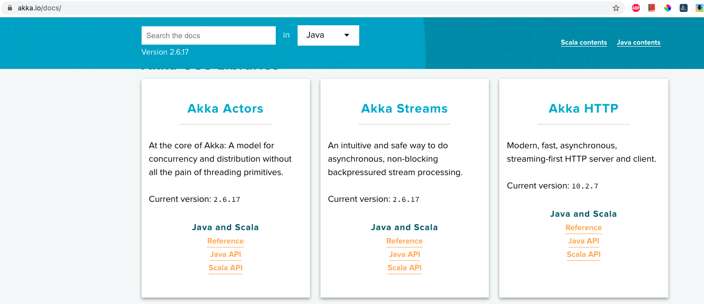

10. Setting up an Akka project Create new Maven project chapter 4 
- Classic API
- https://akka.io/docs/
- https://doc.akka.io/docs/akka/current/typed/index.html 

- [Project Code](https://github.com/ckgauro/java/tree/master/Practical%20Java%20concurrency%20with%20the%20Akka%20Actor%20Model/Section%204%20Chapter%204%20%20Creating%20our%20first%20actor/Project/Chapter4AkkaBigPrimes)
 
```xml
    <dependencies>
        <dependency>
            <groupId>com.typesafe.akka</groupId>
            <artifactId>akka-actor-typed_2.13</artifactId>
            <version>${akka.version}</version>
        </dependency>
        <dependency>
            <groupId>com.typesafe.akka</groupId>
            <artifactId>akka-actor-testkit-typed_2.13</artifactId>
            <version>${akka.version}</version>
        </dependency>
        <dependency>
            <groupId>ch.qos.logback</groupId>
            <artifactId>logback-classic</artifactId>
            <version>1.2.3</version>
        </dependency>
        <dependency>
            <groupId>org.junit.jupiter</groupId>
            <artifactId>junit-jupiter-api</artifactId>
            <version>5.5.2</version>
            <scope>test</scope>
        </dependency>
        <dependency>
            <groupId>org.junit.jupiter</groupId>
            <artifactId>junit-jupiter-engine</artifactId>
            <version>5.5.2</version>
            <scope>test</scope>
        </dependency>
        <!-- https://mvnrepository.com/artifact/org.projectlombok/lombok -->
        <dependency>
            <groupId>org.projectlombok</groupId>
            <artifactId>lombok</artifactId>
            <version>1.18.22</version>
            <scope>provided</scope>
        </dependency>

    </dependencies>
```

 In this chapter, we're going to create our first actor. This first actor won't be able to do very much. It will be able to receive a message and print something to the screen. Although, that doesn't sound very useful, it will allow us to explore some of the complexity of **Akka** code. If you want to look at a complete **Akka** application right now, you would see a lot of quite complex looking code.
 
 So we're going to start with this really simple example first of all and then build up to the more complicated looking **Akka** code that you'll be very familiar with, very comfortable with, and happy to write yourself by the end of this course. So to create code in Akka, we need to have a couple of Java files in our projects. And the easiest way to get these is to use a build tool like Maven. let's create a new Maven project. I don't want to choose an archetype. I want to do everything manually, so I'm just going to click Next, and we'll give the project a name, which I think this time could be "Akka Big Primes". 
 
 Okay, I'm going to click on Finish and then what we'll do is open up the project's pom file and start editing this to get to the dependencies that we need into our application. So we're going to need some dependencies. 
 
 ```xml
 <dependency>
    <groupId>com.typesafe.akka</groupId>
    <artifactId>akka-actor-typed_2.13</artifactId>
    <version>${akka.version}</version>
 </dependency>
```        
 So let's start in a dependencies tag, and in here the first dependency is going to be a group Id of **com.typesafe.akka**, and the artefact id will be a **akka-actor-typed**,  and then we'll need an underscore and a number, and that number, we're going to go with is latest available version which is 2.13. We're also going to have a version number in here, which is going to be the latest version of Akka. that is 2.6.3. And I know it's not showing up here, but it will be able to retrieve this when I run the pom in it and import that. 
 
 This one Java file is the minimum that we need to start creating actors with Akka. The actual artefact Id is **akka-actor-typed**. Now, this is the newer API for Akka that was actually made production ready in version **2.6**. So in order to use **akka-actor-typed**, which is what we're going to be using on this course, then you must make sure the version of Akka that you're using is at least **2.6**. If you're using an older version of Akka, you'll be forced to use what's called the **"Classic API"**. 
 
 Now you can use either newer typed API, or the Classic API if you're on version **2.6** or above. And by using this **akka-actor-typed** that allows us to choose which API we're going to work with. I'm going to mention a couple of things about the Classic API a little bit later on in the course, probably when we look at the documentation, but for now we're always going to be working with **akka-actor-typed**, which is as I said the newer API. 
 
 The other thing is that you're looking here at two different version numbers, so I want to just explain that as well. The **2.6.3** is the version number of **Akka**. So that is, the latest version of **Akka** available. This number here **2.13** in **<artifactId>akka-actor-typed_2.13</artifactId>**, actually refers to version of Scala that Akka is using. 
 
 The Akka library is written in Scala, not Java, but you don't need to know any Scala or even have Scala on your machine to use Akka. We won't be writing any Scala in this course, but I just wanted to make clear, the two different numbers here and what they refer to. When I didn't mention **Akka** documentation, so actually now might be a good time, just have a very quick look at that. 
 
The starting point for the (Akka documentation)[https://akka.io/docs/] is this website I've got on screen, which is **https://akka.io/docs/**. Now, if you look in this section here Akka Actors, most of the documentation we're going to be interested we'll find from the links here. There are three links called Reference, Scala API, and Java API. 



If you click on the Java API link, what you'll actually get are the Java docs for the **Akka** library. Now these will be useful, and we may well look at these at some point in the course, but most of the time what you'll probably find more useful, is to click on this link here that says Reference. Now when you're on this page, the first thing hopefully you'll notice that there is a drop down here to choose whether you're interested in Scala or Java https://doc.akka.io/docs/akka/current/typed/actor-lifecycle.html. And as you can see at the moment I've got Java selected. If you're on any of the pages in the documentation, for example I'm just going to click on Actor Lifecycle here. The documentation is relatively readable and throughout the documentation you will see code snippets here. And the code snippets are available either as Java code snippets or as Scala code snippets. But, whatever you've selected in this dropdown will determine which of these you see by default. So it's useful to make sure you've got Java here. There's a search facility here, so for example if we were interested in behaviors, I could be typing in the word behavior and it will give me links to pages that might well be interesting for us to have a look at. 
 
So, that's the starting point then for the Akka documentation. The only other thing I want to just point out then, is that by default you will be looking at the documentation for the newer typed API. But, at the top of the page there'll be a link to take you to the older Classic documentation. The older Classic API (https://doc.akka.io/docs/akka/current/actors.html) . If I click on that, at the top of any page that's relating to the Classic documentation, there'll be some kind of note to tell you this is relating to the original or older API. And actually there'll be a link to the relevant, newer API page. So, if you're doing a search through the documentation, maybe you've searched on Google for example, it's taken you to one of these pages. Just check at the top of every page that you're looking at the Akka typed API, and if you're not there will be a link to click on to take you to the relevant page. Okay, well let's go back to Maven. Now, as well as the Akka dependency, we will need to get a logger into our system. https://doc.akka.io/docs/akka/current/actors.html
 
```xml
<dependency>
  <groupId>ch.qos.logback</groupId>
  <artifactId>logback-classic</artifactId>
  <version>1.2.3</version>
</dependency>
```

 Some kind of logging system, because Akka uses log4j and that will require an underlying logging framework. Now they recommend that you use log back, so we'll do that for this course. So, let's put in another dependency here. And the group ID's going to be **ch.qos.logback** and the artefact ID is logback-classic and we'll put a version number in here as well. Latest version is 1.2.3. Okay, I think that's going to be all right. And these are the minimum that you need to create an **Akka** system. But, while we're in the pom, I'm going to add in a couple of further dependencies that we will need later on in the course. And that is just to allow us to write unit tests for our actors.
 
 ```xml
 <dependency>
  <groupId>org.junit.jupiter</groupId>
  <artifactId>junit-jupiter-api</artifactId>
  <version>5.5.2</version>
  <scope>test</scope>
</dependency>
```
 There's going to be a whole chapter on testing, so we won't need this until we reach that chapter, but as we're in the pom let's add them in, and then everything will be, hopefully, ready for us to use and start coding. So, the first thing I'm going to do is add in a dependency for J unit, so let's put that in next. And we'll use J unit 5, the latest version of J unit in this course. So, that's going to have a group ID of **org.junit-jupiter** and an artefact ID which will be junit-jupiter-api and I have choose **5.5.2**. Incidentally, if you want to use a later version of any of these that should be absolutely fine. I will put in a scope, I think of tests for Junit, that would make sense. 
 
 ```xml
  <dependency>
            <groupId>org.junit.jupiter</groupId>
            <artifactId>junit-jupiter-engine</artifactId>
            <version>5.5.2</version>
            <scope>test</scope>
        </dependency>
 ```

 And then as well as the Jupiter API, we also need the **Junit Jupiter engine**. So, I'm going to copy this dependency and paste it in again. And this time rather than Junit Jupiter API, it'll be Junit Jupiter engine. And then finally to be able to write unit tests  for our Akka system, there's another dependency we need which is called the Akka Test Kit.
 
 ```xml
<dependency>
  <groupId>com.typesafe.akka</groupId>
  <artifactId>akka-actor-testkit-typed_2.13</artifactId>
  <version>${akka.version}</version>
</dependency>

```

So, I think I'll put this one next to the Akka one. So, in fact let's copy and paste the dependency and then we'll edit it. So, on our second version rather than being **akka-actor-typed**, it's **akka-actor-testkit-typed**. Now, it's important that the version numbers for our underlying **Akka** system and the test kit are the same. So, in case we want to change one of these in the future, I think I'm going to extract this and have this as a version number outside of my dependency system.

```xml
<properties>
  <akka.version>2.6.17</akka.version>
</properties>
```    
So, let's create a new section called properties, and then in here we'll have a **akka-version**, which we'll set to **2.6.3**, we'll set the version here then to be in curly brackets **akka-version**, and we'll do the same thing for the test kit as well. And then hopefully, that should be my pom complete. Oh, I just need to put the dollar symbols in of course, before the curly brackets. Okay, that should be everything complete. I'm going to enable auto import in my ID, get all the changes into my project. If you're following along with me and you're not sure you've got everything right, this pom file will be in the workspace for the closing project for this chapter. So, do go and have a look at that if you need to, but hopefully, you'll have everything working.And that means our project is set up and we're ready to start.

 -------------

## 11. Creating our first actor - constructors 
 FirstSimpleBehavior AbstarctBehavior 

- ActorContext
 
```java
 public static Behavior<String> create() {
  return Behaviors.setup(FirstSimpleBehavior::new);
 }
```

### Akka Actors:
The Actor Model provides a higher level of abstraction for writing concurrent and distributed systems. It alleviates the developer from having to deal with explicit locking and thread management, making it easier to write correct concurrent and parallel systems. Actors were defined in the 1973 paper by Carl Hewitt but have been popularized by the Erlang language, and used for example at Ericsson with great success to build highly concurrent and reliable telecom systems. The API of Akka’s Actors has borrowed some of its syntax from Erlang.

Explanation:

Now we saw in the last chapter, there is an actor made up of a path, a message queue and a setup behaviours. The code that defines what an actor does when it receives a message. Akka takes care of most of this for us so in fact, the main part of the code we'll be writing is the code that defines an actor's behaviour and the messages that an actor can send or receive.

So in fact, we don't really code up actors in Akka, really what we're creating are **behaviours**. And to do that, we need to create a class that extends abstract behaviour. So let's create our first class and that's going to be a standard Java class and I'm going to call this first one **"FirstSimpleBehavior"**. so our first simple behaviour class is going to be to extend an abstract class which is called **AbstractBehavior**. 

### AbstractBehavior : akka.actor.typed.javadsl.AbstractBehavior

```java
import akka.actor.typed.Behavior;
import akka.actor.typed.javadsl.AbstractBehavior;
import akka.actor.typed.javadsl.ActorContext;
import akka.actor.typed.javadsl.Behaviors;
import akka.actor.typed.javadsl.Receive;

import lombok.extern.slf4j.Slf4j;

public class FirstSimpleBehavior extends AbstractBehavior<String> {

 private FirstSimpleBehavior(ActorContext<String> context) {
  super(context);
 }

 public static Behavior<String> create() {
  return Behaviors.setup(FirstSimpleBehavior::new);
 }

 @Override
 public Receive<String> createReceive() {
  return newReceiveBuilder()
    .onAnyMessage(message -> {
     System.out.println("I received the message :" + message);
     return this;
    })
    .build();
 }
}
```
 ***AbstractBehavior*** is a generic class type and the type that we put in here in angle bracket is the definition of what the messages will look like that this class can receive. So for our very first simple actor, we want to have a behaviour that is able to receive and process messages that are strings. So for now, let's just put in here that we are going to extend an **AbstractBehavior** of type `string`. We'll be using other more complex messaging types as we progress through the course but for our simple actor, that's going to be fine. Now having extended **AbstractBehavior**, there are a couple of things we will need to do to make this class compile. 
 
 We need to implement a constructor because there is no default constructor in the abstract class and we need to implement a method called **createReceive** is the message handler. That code is going to run when a message is received but we also need the constructor. So let's get the idea to create the constructor for us as well. Now both of these method stubs are going to be a little bit of work so let's start with the constructor. Now what we're about to do here is actually going to become code that we will do with every behaviour that we create. At first glance, what we're about to type in might look quite complicated but it's worth spending a bit of time to understand this because we will be doing it a lot. So I'm going to build this code up a little bit slowly. Now we have a problem if we want to call this constructor. And that problem is that a constructor requires us to provide a parameter of type **ActorContext**. Now, we will later on learn what this **ActorContext** object is but the problem is that when we want to instantiate this class we might not necessarily, easily be able to get a reference to this **ActorContext**. 
 
 ###  Inside FirstSimpleBehavior class
 ```java
   public static Behavior<String> create() {
        return Behaviors.setup(FirstSimpleBehavior::new);
    }
```

 But there is a static factory method called behaviors **Behavior<String> create()**. setup that we can use to get this **ActorContext** from. So in order to be able to call this constructor, we need to first call **behaviors.setup**. So what we'll do is make this constructor private and then we'll create a public static method **public static Behavior<String> create()** that we can call and in the public static method, we'll call that **behaviors.setup** and then use that to call the constructor. That sounds complicated but let's type it in and you'll see what it's going to look like. So we're going to create a public static method. Now the return type is going to be a Behavior which is a generic type and it's Behavior of type string and actually that's the whole point of what we are trying to create here. By extending AbstractBehavior we're trying to create a class which is a Behavior with the same message type defined. We'll need to import the Behavior class. So let's do that. And we'll call this method **"create"**. It won't need to take any parameters and then in here, what we want to do is call the constructor and return the results.


 Now as I mentioned, before we can call this constructor, we need an object of this **ActorContext** type. And the way we can get that is from the behaviors.setup static helper method. So that's going to look like this. It's Behaviors, and that's a class that again, we'll need to import. Now at this point, you might have noticed that as we do these imports, they appear and lots of them with the same class name but in different packages and in fact, in this example, this is a great example, the package which is **akka.actor.typed.javadsl** or **akka.actor.typed.scaladsl**, it is really important that you always import from the **javadsl** package. If you import from the **scaladsl** package, you will probably find the code won't compile and in fact, if at any point when you're using Akka and you're typing something in you think that was correct but you find the code isn't compiling, the first thing to check is that your imports are all **javadsl** import, they're not the **scaladsl** imports. The other thing to point out is that a lot of class types we are importing here exist in both the **akka.actor.typed** package namespace and in the akka.actor package namespace. So always make sure again, the typed appears somewhere in the package name. Okay but let's go back to where we were. So we were importing Behaviours from javadsl and this has a method called setup and this method takes a lambda. So it's a single parameter lambda and the parameter name we'll call context. So let's put in the rest of the lambda structure and I'm just going to put semicolon in the end here. So this context object is the one that we want to get hold of to pass into our constructor up here. So what we should be able to do is within the body of the lambda, create a new first SimpleBehavior because that's within side the code, even though we've made our constructor private will be able to call it so I should be able to do in here a new **FirstSimpleBehavior** and the parameter is that context object to the parameter for our lambda. And actually this is what we're going to want to return from our public static method. So I really want to put a return in here and a return out here. 
 
 Now I've said that the code we're writing here when you first look at it looks complicated but I hope what is clear is that when we want to instantiate an instance of Behavior, at least our **FirstSimpleBehavior** example, we're not going to be calling **new FirstSimpleBehavior**. Instead what we're going to do is call this **create** method which is a static help method we've created and that create method is going to do the job of instantiating our **FirstSimpleBehavior** for us. Okay, we haven't written that. We can actually simplify this code very slightly. It's just a different way of writing this lambda, when it's a single parameter lambda. I'm not sure if you're familiar with this but I'm going to just put this in rather than calling **new FirstSimpleBehavior** and passing in the single parameter. What we can do is not give the parameter a name, we don't need to return keyword and then we'll call **FirstSimpleBehavior**, colon. We're going to make the constructor private and create the static help method. Okay so that's creating the Behaviour. That's the definition needed to define an actor. Next, we'll have a look at this create receive method which is called the message handler, the code that's going to run when a message is received. **return Behaviors.setup(FirstSimpleBehavior::new);**

-------------- 

## 12. Creating our first actor - defining behaviors 


```java
public Receive<String> createReceive() {
  return newReceiveBuilder()
    .onAnyMessage(message -> {
     System.out.println("I received the message : " + message);
     return this;
    })
    .build();
}
```
This message handler method then, is the main part of the code we're writing when we work with actors. It's the definition of how an actor should respond to a message, what code do we want it to run? What processing do we want it to do whenever a message is received. Now this method as we can see needs to return an object of type C. I don't want to say too much about this receive object just yet. We are going to talk about it in some depth a little later on in the course. But for now, what we will do in this method is again somewhat border plate code, we're going to use a help method called **"New Receive Builder"**. So I'm going to code up here the simplest version that we can possibly do our message handler, and then we'll talk about it together. So rather than returning null, we're going to return, we'll call this help method **"New Receive Builder"**. That New C Builder is a method on the abstract behaviour clause that we're extending from. So that's why we're able to call it. And then on this we're going to pull a method in a minute, which is going to be one of these one message or one message equals methods. I'll talk about those in a moment, but we're going to be chaining these together and the very last method in the chain is going to be the build method. So I'm going to put build semi-colon and actually we'll see that code will compile. That's not actually going to do anything just yet, it's going to ignore any message we might receive. We want to process a message and all we're doing in this processing is print it out to the console. 

So what it will do is put one of those on message methods in here, and I'm going to choose for now the on **onAnyMessage** method. We'll be looking at some of the different ones here a little later on. So the idea is that on **onAnyMessage** whatever message is that's being received, we're going to run some code. And the code in here that we're going to run, is to find as a lander. So what we'll do is give the message a name, that's the parameter for lander, I'll call it message. And then in curly brackets, we can say what's the code we want to run. Now this code then is just going to be to print out the message to the console. So I think what we'll do is a system out print line that says **"I received the message"** and then we'll add the message to the end of our print line. Now this code block within the lamda does need to return something, again I'm going to talk about this return type in a bit of detail in a little bit later on. For now, I'm just going to return this. And again, we will go into nonstandard properly very soon, I promise you. So this code we've written here is our first basic behaviour completed. At first glance this is quite complicated looking code, but actually most of this is going to become boiler plate code and as long as you understand the basics of the constructor and how that works, and the principle of what the message handler is going to be doing, that's going to be good enough for now. We'll be creating lots more actors and writing lots more message handlers as we progress through the course. And as we do that, how these fit together, how these work is going to become completely clear. 

------------ 
## 13. Instantiating actors and sending messages 

 ### Inside Main
 ```java
public class Main {
 public static void main(String[] args) {
  ActorSystem<String> actorSystem = ActorSystem.create(FirstSimpleBehavior.create(),"FirstActorSystem");
  actorSystem.tell("Hello are you there?");
  actorSystem.tell("This is the second message.");
 }
} 
``` 
So we've defined our **FirstSimpleBehavior**, now let's create a main class, and we'll use that, we'll make it a runnable class so that we can instantiate an actor that uses his behaviour and we'll send it a message. So we'll start with a new class, and I'm just going to call this main,  and I want this class to have a main method so that it's runnable, inside main method and then what we want to do in here to instantiate the first actor **ActorSystem<String> actorSystem = ActorSystem.create(FirstSimpleBehavior.create(),"FirstActorSystem")** in our system; we need to create something called an **ActorSystem**. And we'll use a static helper method called **ActorSystem**.create to do this. So it's going to look something like this, we're going to say **ActorSystem**,  which will lead to import, and notice here there are two versions; we must make sure we pick the one from **akka.actor.typed**,  so the **ActorSystem** object has a helper method, it's a static method called create.  And this method takes two parameters.

The first is an instance of the behaviour that we want our actor to have. Well, if you recall, we've created our **FirstSimpleBehavior** and we gave it this static helper method called create to instantiate it.So actually, this is where we're going to call **FirstSimpleBehavior.create()**. So let's put that in as our first parameter.  

And then the second parameter is going to be the name for an **ActorSystem**, so that's any string and we'll call this, I think, **FirstActorSystem**.  So this helper method, this create method is going to return an object and it's an object of type ActorSystem, so let's store the results.  and I'll call this one actorSystem. And then actually ActorSystem we've got here is a generic object type and so we should specify the generic type and it's the type that defines the messages our ActorSystem can receive. We said that our first simple behaviour can receive string messages so this is going to be an ActorSystem with a generic type of string.

Now again, don't worry too much if it feels like we're going quite quickly, this doesn't make complete sense just yet because again, a lot of what we're doing here is going to become boiler plate code that we're going to write again and again. But hopefully, what we've now done is instantiated our actor. This **ActorSystem** object type that we've created, we can think of this as just being an actor. Actually it's a wrapper for the first actor that we are going to create; the entry point into akka. Later what we'll see that actors are going to create more actors, or child actors, but we'll always communicate through the very first actor that we create, the one that we call the ActorSystem. So the ActorSystem then is really an actor but with a few extra features that we're going to learn about a bit later on. We can use **ActorSystem** though, just as though it was a standard actor and any messages we send to it will get sent to the duty fork entry point actor that we are creating. So now that we've got an actor, we can send it a message by calling its tell method. So that will be actorSystem, the name of our actor, dot tell, and then we need to place an error message, that's going to be a string because this first actor can accept strings so I think we should put in something like, **"Hello are you there?"**  So before we run this, let's just recap that what we've done then is we've instantiated an actor, that's this object here called **ActorSystem**. Actually, we used a helper method called **ActorSystem**.create to instantiate the actor for us, and what got instantiated here then is an actor with a name, a path, a message queue, and a set of behaviours. 

We had to provide that set of behaviours and we did that by instantiating with our special helper method, the behaviour that we defined; our **FirstSimpleBehavior**. So akka took our behaviour that we created and created an actor from it with all the other features we need; a path, a message queue, and all that kind of stuff and we will see some of that a little bit later on. But now, if we run this code it should work. So let's run it and see what happens. Okay, well we've got some logging information here, but importantly, printed out to the console is **I received the message: Hello are you there?** . 
So that means we managed to create the actor, we sent the actor a message, and our behaviour received that message and processed it by printing it out to the console. So that's great, we've created our first actor, we've sent it a message, and we've seen the message being processed. Notice that our application is still running and it will carry on running until we shut it down. We're going to learn how to do that programmatically a little later on, but for now we'll need to stop the application after it's finished by clicking on the red box here.  The idea is that the application will by default just run indefinitely because our actor can receive multiple messages. So in fact, we could just prove that by sending the actor a second message, let's go back to our main method and we'll do an **ActorSystem.tell**,  **"This is the second message."**  And we'll run this again.  and we can see now both messages were received. Let's just stop this running. Okay, well this has I think been quite a tough chapter, there's been some code that we've written here that doesn't look too straightforward. But again, don't worry if you don't fully understand everything just yet; it will, I promise you, all make sense as we progress through the next few chapters. As long as you're comfortable at this stage, that we've defined the behaviours, the way an actor will respond to a message, and we've seen that we need to instantiate behaviours with a special format of the constructor, then that's a good start. Coming up in the next chapter, we'll see how an actor can create a second actor and then we'll have two actors and they'll be able to communicate with each other, and that's going to allow us to then, in due course, implement the big prime number example that we saw right at the beginning of this course. So I'll see you when you're ready in the next chapter.


### Run the program

We get following result

```txt
20:11:08.228 [FirstActorsSystem-akka.actor.default-dispatcher-3] INFO akka.event.slf4j.Slf4jLogger - Slf4jLogger started
I received the message :Hello are you there?
I received the message :This is the second message.
```