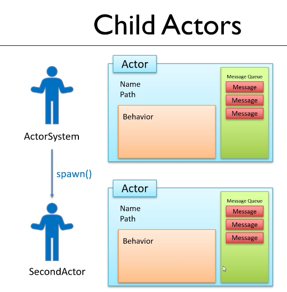

### 14. Expanding the receiveBuilder
chapter 5
### FirstSimpleBehavior 
```java
@Override
public Receive<String> createReceive() {
return newReceiveBuilder()
                .onMessageEquals("say hello",()->{

                    System.out.println("Hello");
                    Thread.sleep(4000);
                    return this;
                })
                .onMessageEquals("who are you",()->{
                    System.out.println("My path is "+ getContext().getSelf().path());
                    return this;
                })
                .onAnyMessage(message->{
                    System.out.println("I received the message :"+ message);
                    return this;
                })
                .build();
    }
```
### Main
```java
import akka.actor.typed.ActorSystem;
public class Main {
    public static void main(String[] args) {
        ActorSystem<String> actorSystem=ActorSystem.create(FirstSimpleBehavior.create(),"FirstActorSystem");
        actorSystem.tell("say hello");
        actorSystem.tell("who are you");
        actorSystem.tell("This is the second message.");
    }
}
```
Hello again, in the last chapter, we created our first actor,and we sent that actor a message.The actor did something with that message.It printed it out to the console.Now, if we want to implement the big primes example in **Akka**, we're going to need more than one actor.And we'll want the actors to be able to do some real work to calculate the big prime numbers.Creating a new actor from an existing actor is quite easy to do, but there are a couple of small things we will need to know about before we can start coding that up.

The first of these is to learn a bit more about this new receive builder function that we used in our behavior class. In this function, so far we've used the on any message method to match any kind of message.It actually didn't matter what the string was we sent to this actor even on a null string. It meant that this print line code would have run.If I put a dot in here after our new receive builder. we'll see that there are some alternatives that we can use.The most general is the on message method.This let's us define a specific class type to match against and we will come to that version,we'll look at that a little later on.For now, we're going to be interested in the other option, which is onMessageEquals.Because we're working on a set of behaviors that responds to string messages. It makes sense to say if the string is the phrase create a child, 

for example,then we want to run one piece of code.But if it's print to the console we do something else. So we can use the on message equals method to create a chain of instructions and **Akka** will execute the first matching entry in this chain So if, for example, we do something like **onMessageEquals** and in quotes "create a child."  and then there'll be some kind of lambda to go in here. I'm just going to put in an empty lambda for the moment, just to signify that we need to put something in here. Well, if we sent a message that says, "create a child," then this lambda would get executed. Any other kind of message would mean that this lambda gets executed because **Akka** will match against the first of these methods that matches that is able to process the message. If we put these the other way around, If we said **onAnyMessage**, and then **onMessageEquals** well, this second version would never get to run because **onAnyMessage** will always match any kind of message. But we can create these chains so we could say if the message is **"create a child"** do this if the message is, say, **"print your name"**  we'll do something else and then, maybe, have this catch all at the bottom to say we'll do that with any other kind of message. So let's see this working. I think we'll start with a message that says **"say hello."**  And if the actor receives a message like this what we'll want to do is print out to the console. 

So let's put in here something like a system out print line **"hello"** something nice and simple. And we always have to return something from our lambdas and, for now, we're always just going to return this. Again, I mentioned this before but we will look at this return type a little later on. So every time this actor receives a message if the message is the string **"say hello"** we're going to print out the word hello to the console. We could also do something like, **"who are you"** as the message,  and actually let's use this as an opportunity to find out the path of the actor. So, in here, what we'll do is a system out print line and the way that we find out the path is I'm not going to explain this construct, we'll just use it for the moment, so follow along with me. We'll put in a system out print line of **"My path is"** and then we're gonna add on the end of here. We start by calling a method called **getContext** and then a method on that called getSelf, and then a method on that called path. Again, I will explain that a little later on. We just want to see what the path is of the actor so we can understand roughly what that's going to look like. Again, we'll need to return something so we'll return this from that lambda and then, we'll have that catch all message at the end that says I received the message and prints it out. So let's try and test this so we can see these different messages being matched and working So, in our main method, we'll start by sending the message that says **"say hello"** Then we'll send in another message that says who are you, and we need to make sure we get the case of this right because, obviously, we're matching strings here so string equals is going to be used two strings will only be equal, if the cases are the same so get that exactly right as well And then, we'll leave in **"This is the second message."** I know it's the third message now, but that should make the third of those matchers be executed the third lambda in the chain. 

### Run the Main program
Output will be
```txt
Hello
My path is akka://FirstActorSystem/user
I received the message :create a child
I received the message :This is the second message.
```


------------------
### 15. Creating child actors


### Inside FirstSimpleBehavior class
```java
 @Override
    public Receive<String> createReceive() {
        return newReceiveBuilder()
                .onMessageEquals("say hello",()->{

                    System.out.println("Hello");
                    Thread.sleep(4000);
                    return this;
                })
                .onMessageEquals("who are you",()->{
                    System.out.println("My path is "+ getContext().getSelf().path());
                    return this;
                })

                .onMessageEquals("create a child",()->{
                    ActorRef<String> secondActor=getContext().spawn(FirstSimpleBehavior.create(),"secondActor");
                    secondActor.tell("who are you");
                    return this;
                })
                .onAnyMessage(message->{
                    System.out.println("I received the message :"+ message);
                    return this;
                })
                .build();
    }
```
```java
public class Main {
public static void main(String[] args) {
 ActorSystem<String> actorSystem = ActorSystem.create(FirstSimpleBehavior.create(),"FirstActorSystem");
 actorSystem.tell("say hello");
 actorSystem.tell("who are you");
 actorSystem.tell("create a child");
 actorSystem.tell("This is the second message.");
}
 
}

```
So we're ready now to create a child actor. The idea is that we're going to tell the first actor that we create, which is actually going to become the manager in our example. If you remember in the Big Primes example, the manager's going to have a number of employees, and the employees are going to be calculating the Big Primes. So we're going to tell the manager a message. Let's create this now actually. Let's do an **actorsystem.tell()**, and for now we'll make the message the string, create a child. Meaning I want you to go and create another actor, a child actor. And then in the manager, when we can match on that particular message, so let's put in our message equals, and the string, create a child, well what we're going to do is execute some kind of lambda, and in the lambda, we'll want to actually create a new actor. Now for now, because we've only defined one behavior class, which is this first simple behavior.

what we'll do. Create a new actor that has this first simple behavior. So we'll end up with two actors in our system that have the same behavior. Don't worry if that sounds a bit confusing. In a few minutes we'll switch this all to increment the Big Primes example and will then make sense, I promise, but for now I just want to see how we go and create an actor from another actor. Now we saw that to create the very first actor, we needed to use the **actorSystem.create**, this static helper method. Well once an actor exists, if you'll recall, to instantiate the actor, we needed to pass into it's constructor, an instance of this object which is an actor context. The actor context object has a method on it, which allows us to create another actor. It's called the **spawn** method, and we get access to this actor context, by calling a method on our abstract class, called get context. Actually we've called that already here. We'll come back and look at the other things we can do with get context quite soon, but the idea then that in this lambda, when we want to create a new actor, we can call get context, and that has a method called **spawn**, and **spawn** allows us to create a new actor. The **spawn** method actually takes the same parameters, as the **actorSystem.create** method. 

There are two parameters, the first is an instance of the behavior and the second is a name. So the instance of the behavior is going to be a new first simple behavior. Well we're going to create that by calling the create method, the static method that we set up before, so that's going to be **FirstSimpleBehavior.create**, and then we need to give it a name. I think we'll call this one second actor. Now when we used **actorSystem.create**, what got returned was an instance of actor system. This time, what will get returned is an instance of an object of type actor ref. So it's going to be a actor ref, and it's a generic type, the type is string. Let's give it a name, second actor. And we'll just import actor ref, so when this line compiles, make sure you pick the one from **Akka** actor type, not just akka actor. And I'm just going to return this, at this point, so that our code is compiling. But let's just say a couple of things about what we have done here. We started with our first actor, which we called actor system. That has a name, a path, a message queue, and we created by generating an instance of our behavior class. Our first actor is actually creating a child actor, by calling the **spawn** method.




So the child actor, which we in this instance, called second actor, also has a name, a path, a message queue, and a behavior. Now what's important to understand at this point, is that these two actors are completely separate. They will have their own state. In order to generate the second actor, we needed to create a new instance of our behavior object, so although they share the same behavior, meaning they're generated from the same underlying behavior class, the instance of the behavior class, that each of these actors have, will be different so in the state stored in this class, won't be seen by this actor, and that's what makes this system completely threat safe. Although these actors share the same behavior, they'll do the same sorts of things if they receive a message, any internal state of the actor, will be unique to that actor. So we've generated this second actor, and this is the first time we've seen actor ref object type. Well this is just simply a reference to an actor and actually actor ref is the main object type we work with when we are dealing with actors. 

**ActorRef** is actually an interface. If you recall, when we created the first actor, and object of type **ActorSystem**, I said this was a special type of actor. It actually implements the **ActorRef** interface, and it's this interface that gives us the tell method. Actor system has everything in actor ref, and a few more things that allows us to control **Akka** which we'll see a bit later on. But we can think of actor system as just being an instance of an actor ref and so is our second actor. So both of these have the tell method. I can check that, I can do here, SecondActor.tell, and we can indeed pass that second actor a message. So in fact let's do that. Let's send a message to the second actor that says **"Who are you?"**. So before we run this, let's go and check what we think should happen. In the main method, we're going to say to our first actor, **say hello**, and that's going to print out the word **hello** to the console. We're going to say **who are you**, and that's going to print out the actor's path. Then we're going to say create a child, and what should happen is that a new actor is going to be generated, and our first actor is going to send our second actor a message that says who are you, and the second actor should print out it's path to the console, and then finally we'll get that this is the second message that should be dealt with by that first actor again. Let's run this and see that that is indeed what happens. I haven't actually stopped my application running from the last time, so I'll do that first, and then we will run it again. Great, so we can see **hello**, the path of the first actor, the path of the second actor, and then this, I received the message, this is the second message. In the next video, we'll talk about what these paths really mean.


### Run the Main program.

Output will be
```txt
Hello
My path is akka://FirstActorSystem/user
I received the message :This is the second message.
My path is akka://FirstActorSystem/user/secondActor
```

------------------
### 16. Actor paths

### Run the Main program.

Output will be
```txt
Hello
My path is akka://FirstActorSystem/user
I received the message :This is the second message.
My path is akka://FirstActorSystem/user/secondActor
```

So having created two actors, we can see we have two different paths. These paths are really URLs. The first part **akka://** is the data type, or the URL type, that akka is going to use. We next have first actor system, this is actually the name that we gave to the entry point actor, or the first actor in our system. And in fact every the actor sits under first actor system, or what ever name we provide here. By default the very first actor that we create, has a name of user. So this first actor, the one we called actor system, really is the user actor, that's its name, within the path of **akka://FirstActorSystem**. This is normally referred to as the user guardian. And so every actor system will always start with the user guardian. That's a path of **akka://TheSystemName/User**. 

Any actors created by the user guardian, will have a path that starts with the current actor, that's that user guardian actor, then a forward slash, and then the child actors name. So the structure of our actor paths, or actor URLs, is a hierarchy, allowing us to navigate to the actor, via it's parents. If you recall we mentioned earlier in the course, that the path is a bit like the equivalent of finding the employee in the company. In a real life scenario we might know that James, sits at the third desk in row two, and that's how we would locate him. Well in our scenario we would locate the actor James, by saying he's an actor that's been created by the manager, or the user guardian. So we expect the path to James to be **akka://** what ever our system name is called, forward slash user, forward slash James. And if James had another actor that he had created, maybe an actor called Sally, that would be forward slash James, forward slash Sally, and so on. Now actually doing this, finding an actor from it's path, turns out to be quite a complex operation, it's beyond the scope of this course, and it's something we rarely need to do. We don't normally need to find actors from their paths, but understanding actor paths is useful for understanding the way that actors exists hierarchically, in actor. And there's something else that I can now talk about which makes sense because we know about actor paths. And that is whenever we create an actor, and that included naming our actor system actually, we have to give actors names that will be valid within a URL that looks something like this. So actor names can't contain spaces for example, in fact they have to be made up of, upper and lower case letters, numbers, dashes, or underscores, those are the only characters you can use in an actor name. 

------------------

### 17. Starting the big prime example

```java
import akka.actor.typed.Behavior;
import akka.actor.typed.javadsl.AbstractBehavior;
import akka.actor.typed.javadsl.ActorContext;
import akka.actor.typed.javadsl.Behaviors;
import akka.actor.typed.javadsl.Receive;

import java.math.BigInteger;
import java.util.Random;

public class WorkerBehavior extends AbstractBehavior<String> {
    public WorkerBehavior(ActorContext<String> context) {
        super(context);
    }
    public static Behavior<String> create(){
        return Behaviors.setup(WorkerBehavior::new);
    }

    @Override
    public Receive<String> createReceive() {
        return newReceiveBuilder()
                .onMessageEquals("start",()->{
                    BigInteger bigInteger=new BigInteger(2000, new Random());
                    System.out.println(bigInteger.nextProbablePrime());
                    return this;
                })
                .build();
    }
}

```

Okay, well I think we know enough now to start building the big primes example. I'm going to use this project to do that, I want to leave this code in in case you want to refer to it in the closing workspace for this chapter, so what I think I'm going to do is comment out this existing main method and we'll create a brand new one, and then we'll ignore the **FirstSimpleBehavior** and we'll start creating our special behaviors for our primes application. So before we start writing the code, let's remind ourselves what we're going to try and create here. We're going to have the manager of our project, or the user guardian, the entry-point into our system, and that's going to contain the list of big primes once they are generated. 

The manager is going to create a number of child actors, I think we're going to call these workers, and each worker will receive a message that says, please give me a big prime number, and it will send back to a manager, the message containing the big prime number. So let's start having a go at trying to implement this, and I think we'll start by looking at the behavior for the worker actor. So we'll create a new class first of all, which we'll call **WorkerBehavior**. Now behavior classes always extend **AbstractBehavior**. **AbstractBehavior** is a generic class type, and we need to say what is the message type that a worker is going to receive. The workers are going to receive a message that says, please give me a prime number. Well, this might as well be a string, we could make it something else, we might do that later on, but for now we'll say workers expect to receive a String message. Okay, so to make this class compile, there are two things we'll need to do, we need to provide the constructor and we need to override the message handler, so let's get the ID to create these for us. So we'll do the message handler first of all, that's the method called create Receive, and we'll do the constructor.

Now as this the second time we're doing this again, what we need to do is make that private, and we instead create a public static method that's going to generate an instance of this **WorkerBehavior** for us, so that's going to be a public static method, the return type is an instance of **Behavior** and it's a generic type, the generic type is **String**. So the idea here is although we've called our object **WorkerBehavior**, what we're really returning is something that is a behavior of a string we've re implemented by extending the abstract behavior class. So we'll import Behavior, make sure we get the one from akka.actor.typed, and then we'll call this method create, it doesn't take any parameters, but in here, we're going to instantiate **WorkerBehavior** with that static helper method. That was **Behaviors.setup**, and then all we need to put in here is a call to the constructor in the format of the class name **WorkerBehavior::new**. We'll put a semicolon at the end there, and we'll just import Behaviors, make sure you pick the one from **javadsl**, and that is our constructor dealt with. So now for the receive builder, so I always start by doing return a **newReceiveBuilder**, 

that's the name of the message that we are calling that comes from abstract class that we're extending, we're always going to want to call build at the end of that, and then we can put our different message handlers in the middle here. Now, we're going to be sending a message to the worker that says, please create a prime number for me. That message could be any string we like, I think we'll keep things simple and let's just expect to receive a string with the word start. So I think we can do here **onMessageEquals**, the word start, then we're going to do some processing, so here is where the lambda is going to go. So at the end of the lambda, we're always going to return this, which means that this code should now compile, and that means we're ready to do some kind of processing in here. Well for now, let's calculate and print out one of these big probable primes. So this is code that we wrote a lot earlier on, we can just repeat that here, we'll want to generate a new big integer which we'll call `BigInteger`, and we're going to do that by calling a `new BigInteger`, passing in the parameters of 2000 and a new Random object. We'll just need to import Random, and then having got that, we should be able to do B`igInteger.nextPrbablePrime`. Actually I'd like to print that out to the console so we'll map that in a System.out print line. Okay, so our worker processing for now is complete. It's going to receive a message called start, and when it gets that message, it's going to calculate a big integer and print it out to the console. And just before I leave this video, I've made a slight mistake, this isn't quite compiling because I've forgotten to include the return keyword in our create method, so now at least that code's compiling.

------------------

### 18. Exercise 1 - creating actors
- Create a ManagerBehavior Class
- Receive String messages
- Expect a message called "start"
- Spawn 20 instances of **WorkerBehavior"
- Send each instance a message "start"
- Create the main method to instantiate the system and send the "start" message.

So what we're going to do is create a new **ManagerBehavior** class. This class should expect to receive messages of type string, and will write a message handler that expect to receive a message with a string called start. When it receives this start message, what it's going to do is **spawn** 20 instances of the **WorkerBehavior**, that's create 20 actors, each with their own worker behavior, and then send each of those 20 actors a message with the word "start". When you've done that, when you've created the **ManagerBehavior** class, then have a go at creating the main method to instantiate the system and send the start message to the **ManagerBehavior**. 

------------------

### 19. Exercise 1 - walktrhrough
```java
import akka.actor.typed.ActorRef;
import akka.actor.typed.Behavior;
import akka.actor.typed.javadsl.AbstractBehavior;
import akka.actor.typed.javadsl.ActorContext;
import akka.actor.typed.javadsl.Behaviors;
import akka.actor.typed.javadsl.Receive;

import java.util.stream.IntStream;

public class ManagerBehavior extends AbstractBehavior<String> {

    public ManagerBehavior(ActorContext<String> context) {
        super(context);
    }

    public static Behavior<String> create() {
        return Behaviors.setup(ManagerBehavior::new);
    }

    @Override
    public Receive<String> createReceive() {
        return newReceiveBuilder()
                .onMessageEquals("start", () -> {
                    IntStream.range(0, 19).forEach(i -> {
                                ActorRef<String> worker = getContext().spawn(WorkerBehavior.create(), "worker" + i);
                                worker.tell("start");
                            }
                    );
                    return this;

                })
                .build();
    }
}

```
```java
public class Main {
//    public static void main(String[] args) {
//        ActorSystem<String> actorSystem=ActorSystem.create(FirstSimpleBehavior.create(),"FirstActorSystem");
//        actorSystem.tell("say hello");
//        actorSystem.tell("who are you");
//        actorSystem.tell("create a child");
//        actorSystem.tell("This is the second message.");
//    }

    public static void main(String[] args) {
        System.out.println("Start==>");
        ActorSystem<String> bigPrimes=ActorSystem.create(ManagerBehavior.create(),"BigPrimes");
        bigPrimes.tell("start");
        System.out.println("Finished from main");
    }
}
```
So going to create the **ManagerBehavior**. So that's going to be a new class. We'll call it **ManagerBehavior** and it's going to extend **AbstractBehavior**. And we said that the **ManagerBehavior** is also going to expect to receive string messages. Okay, let's create the constructor and the message handler and we make the constructor private and create our static helper method to create or instantiate the **ManagerBehavior**. So that would be a public static. It's going to return a behavior of type string, which we'll call create and we want to return. And that is **behaviors.setup**. it's **ManagerBehavior::new**. So let's just import behavior and behaviors. and that's compiling, so that takes care of the constructor part.
```java
 public static Behavior<String> create() {
        return Behaviors.setup(ManagerBehavior::new);
    }
 ```   
 Now we want to deal with the message handler. So we always start with returning a new receive builder and we'll want to call build on the end. And then when the message equals the word **start**, we're going to do some processing. So let's have an odd message equals **start** and the second parameter is our Lambda. So in here we'll just to get the scope power, first of all, let's end with a `return this`, 
 
 what we want to do then is create 20 child actors and send each of them a message. So let's create a loop so that we can do something 20 times. So we'll have a full loop I think the int I equals zero I is less than 20 I plus plus. And then within the loop we should be able to do. Well, to generate a new actor. We're going to do get **context.spawn** and the actor is going to be this time an instance of our **WorkerBehavior**. So we can call **WorkerBehavior.create** the static method in the worker behavior class that instantiates a **WorkerBehavior** and we need to give this a unique name. So let's call it worker and then we'll add onto the end the number from our loop. So that should create workers zero, worker one, worker two and so on. 
 
 We want to store the reference to this so we can send us a message. So let's store the result of that as an instance of an actor. It's an actor F We have to take strings and we'll call this worker, I think. Let's import actor F. And then we should be able to do **worker.tell**. and send it the message **start**. So I think that's going to take care of the message handler for our manager. When we send the manager a message with starting, it's going to create 20 workers and send each of them the message **start**. So let's go and create the main methods that we can test this. So we're going to be creating an actor system and it's an actor system that's going to expect to receive strings. 
 
 That's what our entry point to the user guardian, the kind of message that our manager is going to receive. We'll call this big primes, I think. And to generate that, we'll use that actor **system.create** static helper method. So it's actor **system.create** This takes two parameters. The first is an instance of the **behavior**. For our entry point actor, what that's going to be our **ManagerBehavior** and to create an instance of it, we're going to call the create method. We need to give it a name. I think this time we'll just go for big primes. So that would have generated the manager the entry point, now what we need to do is to send a message to that manager, which is the word start. So we do that with big climbs.tell, the word start and I think we are ready to run this, so let's do it and see what the results look like. Going to make the console window a bit bigger. Great, well that's working. We can see the different numbers coming through and it's clearly multi-threaded because we can see that it's pretty fast. We're getting a lot of numbers there very quickly. It can't be calculating one of those at a time. Now to complete this project, we will need the child worker actors to send this data, the number that they have calculated back to the parents manager actor, and we'll learn how to do that in the next chapter. But I hope you've got that working.If you did well done.

 ### Run the Main
 output of the program will be

 ```txt
 Start==>
16:53:26.441 [BigPrimes-akka.actor.default-dispatcher-3] INFO akka.event.slf4j.Slf4jLogger - Slf4jLogger started
Finished from main
SLF4J: A number (1) of logging calls during the initialization phase have been intercepted and are
SLF4J: now being replayed. These are subject to the filtering rules of the underlying logging system.
SLF4J: See also http://www.slf4j.org/codes.html#replay
50885623551734779850354430603406848857532808131484473476803733542401782163609982627687555319934955890040999813151829037830049832390823786521758631253852814932703890308018082855537003590855392744438327687115062823753041236924812994307638872123970318159669356214095152717191582889946289514897341933709003684618847274215038763435663209070099602511491869258412093932204503740971887933591914645253268043853659504865890857627212691915233108075668520328750194416718590376837075630685893739048762138793825929268008619051440642843159452338542042272124109046269680278529364896333887432203382048984066442634866109
325535713158857450483037805694065831367776428034937731620400122884954342223271122655354877141496155264649604538151993395466853954083549159953616509079442508626541565198668837853171718241218803692417264847081960891179583002104279013008180325212875408360919694188687568062268930946427023815618259991184831080595575490891663397512621460077144536874367081563239412626019397590935833904989629700695743864433341092166733594376321238010140122964812810532232021326408625356696376300827104849458130605218305560547587349273341509429461551001273618971985195075313980075209663110425629297927183077862413874543407
22564334947173298129920346082436046456542094175985072808305194518797100847769536999299162526118734336680425969167737225600194369323396384629011194763651791134534762171146439086657792596368868224081732307188234910352417221474690434783327345043527523413820875789910750498973104451476481591598865396147002949704624771445540403011193746494803020271814606479227727548541870945661506147611387549017395376310330637278467494820102243852746912390119352121597291875346234142609562701598649550550082525056576828504406185006900318397027212601016115569107676169262392913627157733008084900964190414049854546161896741
3620003449598328582943682080807174890769778958294846162350603189262867874005897312044075979858301215263888990151041408646449708756782295863934458949175392223959396385744259720326510306485492272366308507899867293960466870110797708681988754531760371487868662924448334830834580709451460082188866005232190852908054405432857450522307122035072616897752714734005547344057064152694693871805273157101822824332988104845825472816302028808436482788065640314638951622908815711414964389790106791151410054801017002060526417482280723604780326998123558361506638166517641789640089036599974349730800450745197343702114619
39490309049241880502112044572341172839242753582271421016598049364647695547625817280701447277960603839349902058490571242694413432293505871685522030370170735220902855983422862316891069274600086596780217885967977107439665576338826635252023297772749801818834520066594704817984236477779475328936761518158364046186627521616046524828744490889471479481867955505239056535742550480963060278953806827615327236050227929999421352235108082740881480247223586039982351573947392202972124831419898388765344728734815643300729282341341262794966828784382233111260087968110406105698781734576601393581708982116669060454812691
31997613885248393706174440340092446065533300664354631049524675728750114112139392831536192496535561590833711420421334443952430639651475670591319518487704488686251707812547083197483732266950230951071097549366794452421566516867155111827631370750539350518306354237689641532921888804807174330186173772596869315553261739463170889497788951326902769817525333461383730335396010109263751561195572668583581320764375491988142225896353838772463684113328258825118251191908467846897186637056352787768594214703213813317538967499003337088523519911014032200489312618813892893019185026766122850048401247176023912433158749
73429058701515303613807483605376274129456929911632246560466841881333969539848125120023763682928961668200134929878223723135701812360447090341979812179871347885555716210225337364838280118606750666101214571993983325513789536688556776218606171604785980823080448647740349921416151847591068117975152248526546136362336419174201884313748021455763655667042096945404275638191981693818281397398044658760446656171906524311000401340337546144394984995553835700113512922883256193630449155733084520259609269024995402515006874590709311237160166332444497535336116489298443372343882479562630437277694991857533776448994087
108653604783182311126850800797195196715108460416985064103689074856059069708562414861527286803291743845732615995979983298046724628856512999904300907185955922977422770573506245848344610451390655989278195627799923464973554843107910464741103026027930030164006712919361569960897531829489015342540778803168016744157806397216427607395763473003778802403984264349186846144057825033968974021605348796232392757228770697941036684626156013009494657242514852822674885828549025036789365370180254433892068468768454689239340478014456059974372093014378421987841825770437273548681680319344846668927166743173157169014065291
68181832980712792242055319313743630241117512454772716987761468368271654406108515903065056766804398231694434306609019269404546252434099369033971830251197859598273227863731886468784086146826781532827335775085025195916968182056263931591489686010416640179118990895227392516202786816601266337748695339030509870133906894237197897031141839776782915067939625522187837541756142713983213319967168115677066979583591181308891280698885012851938725694688272883246697829136527082313645625758605871329027435549861036388760082211781208842920821824357733976659495306185006035466895432597458329201544599682650592114131013
58433228659073989752716267070822821333675555227897498562056929324684616487154550797037283047236737847455673549727822012281393254278321599462405494738956539951615539292790583601287965744331544200528302904042773927133308363982634352847448441554204278091851629726475605563540454986058578728985115944110329675871204676240255164089705355916564641610804960705797269405187263887573403866070653981645231085191048951322713422707805922251034596353817052040724755010119790717768701326239004624213511922166998575473729824367778722337916280567906494936962919725613615359462896569024857014957310413551725271933633867
13187087307141156490227851938183662628743357934054265207560162528564332347301821182729001529388366324648272125075245767790325625234621267171683224786269663915248767200556108642416282958480764223590188988292309982727595266653341562428194609415541520426453937507666922683731159564836210852783694930157275284554133731444105158371223732707160712273437273995644752985894214058590448851528764697603655544654340660013506088860506743580952108764287591668640939867120634719480975512063382599660207738500851769089564579000251533453653492545292783389974397641369592750898317477329200206347743095782538889972212177
55575950700008138697764363480275384868024977523158904874372280235119728952338465624317754898559453761451670312060232893811040200422218552617034780835505330754370315101103773109350455425218961430774231459923805295291745843922997138683963441033859729947220749732665471875898218009411363766873556088393386742293878792011805749572297874794647069955372302604984321395573130511236765955103887152744688801412722092273203419753919411308002883768558683031811865436015936637490882461605463201784529572234718754103310049996382176169962710070632222995841409104053597989641586565372189226619343422267648827692288039
92123117291146667773726154947933808469914326144454926653542913343850240155919363867783923834073093033313790389915844597147117745153851945924526005446515325384362070099987786448375406760627714642905445307646966690744369001239650319357878007912349746451216767888191604278880976037198626191299696382296478248413800493187656415569888916967887603210554219512367438691754768413838625311744072129753508603558971578444035597074084305037525977207067349350038911801354672965732847338271800689853118680363179656274093158937294147461295189974581680421182001860606817602147936910356931087254818740673032630081448841
91812939782115091851955896294917549698700099568392738073980263417131304363505242173251545230847188963754564381254032239984306849255704792492031047761063142314292602954346733629942716503822192317208434460581553418165382168775688392613591996793342094421364793383642811140325019340091601760235756293728265090378597207778552923021946577844476229976045560749662377616652213899265615596492647565852279368659317222718062581412585364546246748142814413939050047063177444597007772290851800851707036079039213178793500332217989736697862239730251275371762203503029760977552870876975223711987130711207375082982119991
72642950854980468664323165045574860442505489752004794609207688739768698066879376990934767613331473811208084566698521604562414353214275497298428703559925424801484355007389812840226653063145176454094280574707475796894150746514083315623500181082543103883844946693717906750791569336549734503353930546069029857764745556457627177722523894510005588873565508526481396159202487435811126613895106127762705403416810818531913673903571685481616744857058030307703518527029214801954665035598720638119342622150383292566755527923662301662292906818974803844549111279434514586216654395227053758316716624477484310095500409
3936359715363097423039943413836051606991995641791624729990945764743058848507273156521211891016309212791903065678998316482503250031807217525405155705086770933480666222840733444231927796197498467112947691030871830207581425314066329850811031408752208915333578135511560111528589567320228873340765174242994860893927244941086911212114088936281137557817726165709084864038565146432844923609770338144400484389435833812242640597441765334048464715136054921226194747424744998794624087151219384511563206132480337222302337987957999598732627701335057960387711880972391304140818361524768998568920162129907619498487687
39660655580951519499653861200713633069011164811498244253414262663036749994235733380175284471663266295600497687119577939187453180865345745255584364583172803328834491230533293526726519193817519234206544176251709556202219945694280582907964158606033615678911760604911477179847224971273038570595987023781216203379245109480002668594051494037578890615168186661410938139844925106404249285487436486164465808498551192935339758307685113113830325979995152350739392108470510189943749478886006922180565541085130550006172108826545944756861626814530540384993624899967548335547977104823811207520431860380106134981129599
97045023617190195113514585889800743471870271599963872880997204511524099171396382524322656820954591938022756103057938956479137082058669171758232853943232512792835502423398223565092357175399216261245586488290532302244967264406420178946361078474938344113763615189663127146453513050001539020163345750179190244810286731652366249515505786101699074999875047273462845304234733240278124971853415629258110221427992472677539106504776900807317986908923216864619351363176517496271564273892360625921155155819778887996278438015468848636736370749201804908314905130925721406281463608901973868182643938951738374358939047
59002233827536797286998240601267171509204777148970437401273131102158058863283765313736303807669286894426946824030498722190768089891449710359643652866360597185019695976886442558343731052790000368066540081951914656619443730073794550852825389083613412998160416119536547875013333100287323315599013718722883074765508861131662972072791027707770815446434495454391106427006696586847099012002767435598965843620823585241152022262208765586847299271632528855805896684468325323590841839800615912940308691096982492955435598282836577733195439811550263455364134430635765413132918305733681942356150083518599150334243883

```
