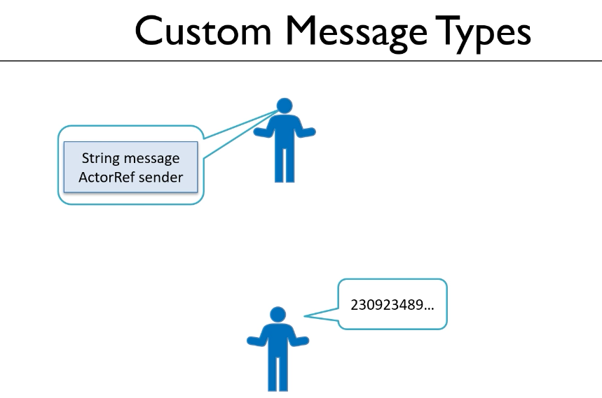
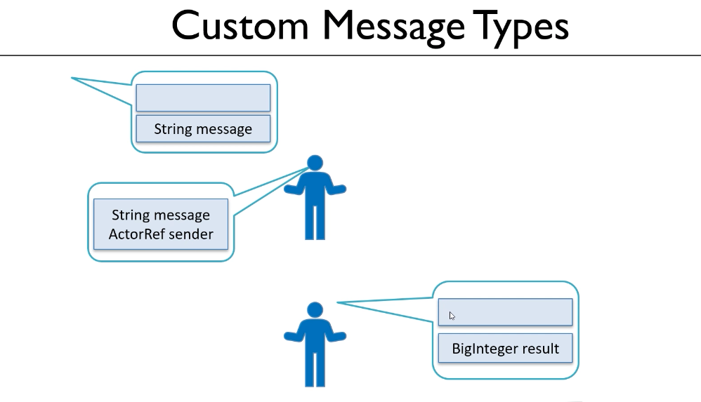
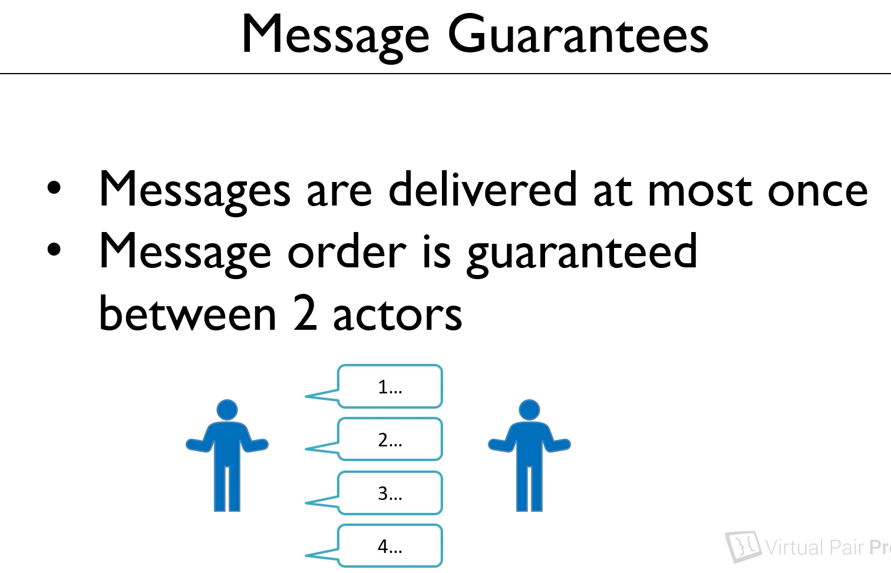

#### 20. Creating a custom message type
 
```java
import akka.actor.typed.ActorRef;
import akka.actor.typed.Behavior;
import akka.actor.typed.javadsl.AbstractBehavior;
import akka.actor.typed.javadsl.ActorContext;
import akka.actor.typed.javadsl.Behaviors;
import akka.actor.typed.javadsl.Receive;

import java.io.Serializable;
import java.math.BigInteger;
import java.util.Random;

public class WorkerBehavior extends AbstractBehavior<WorkerBehavior.Command> {
    private BigInteger prime;

    public static class Command implements Serializable {
        private static final long serialVersionId = 1L;
        private String message;
        private ActorRef<String> sender;

        public Command(String message, ActorRef<String> sender) {
            this.message = message;
            this.sender = sender;
        }

        public String getMessage() {
            return message;
        }

        public ActorRef<String> getSender() {
            return sender;
        }


    }

    public WorkerBehavior(ActorContext<Command> context) {
        super(context);
    }

    public static Behavior<Command> create() {
        return Behaviors.setup(WorkerBehavior::new);
    }

    @Override
    public Receive<Command> createReceive() {
        return newReceiveBuilder()
                .onAnyMessage(command -> {
                    if (command.getMessage().equals("start")) {
                        BigInteger bigInteger = new BigInteger(2000, new Random());
                        System.out.println(bigInteger.nextProbablePrime());
                    }
                    return this;
                })

                .build();
    }


}
 ```

 our child actors are printing out the prime number that they have calculated to the console, but we'd really like them to send this number back to the parent manager actor so that the manager can store it in the sorted set. So how do we get the worker to send the result back to the parent? Well there are a couple of issues here that we need to overcome. Right now, the parent, the manager, can only receive messages of type string, but really we want to send the manager a big integer.
 
 -  So we'll need to allow the parent, the manager, to be able to accept different data types in the messages, both strings and big integers. 
 -  The second issue is that the child, the worker, needs to know where to send the message to. It needs some way to reference the parent manager actor. 
 
 The solution to both of these issues is actually to go a bit further with the message data types. So let's start with the worker. Right now, the worker can only accept a string, which is the word start. But the worker also needs to know which actor to send the results its going to calculate back to. So rather than sending a simple string to the actor, it will be good if we could send both the string and a reference to the sending actor. We can do this if we have a custom data type for our worker's messages. 
 
 
 


 Now messages that actors can send and receive can be any Java class that is serializable. So we can create a custom message type simply by creating a serializable class. So the idea is that our manager actor is not going to send a string to the worker, but it's going to create a custom class which will contain two fields. The string and a reference to itself to the manager class. When the worker actor receives this message, it can do the work and then it can use that reference to send the result back to the person who sent it the instruction. Now the class that we're going to create to define this message type could be created anywhere in our project, but general good practice with **Akka** is to make this a subclass of the  behavior type that we are working with and to call this the **command**. So the recipient of these messages is going to be the worker. 
 
 This will therefore be known as the **worker command** class. It might seem a bit strange at first because it will be the manager that's going to create these messages, but we define them within the class of the recipient of those messages. So we're going to create the worker's command class. So let's go back into our IDE and we'll have a go at doing this. 
 
 ```java
 public static class Command implements Serializable {
        private static final long serialVersionId = 1L;
        private String message;
        private ActorRef<String> sender;

        public Command(String message, ActorRef<String> sender) {
            this.message = message;
            this.sender = sender;
        }

        public String getMessage() {
            return message;
        }

        public ActorRef<String> getSender() {
            return sender;
        }
    }
```    
 
 So in our worker class, and I'm going to put this in right at the top before the constructor, we're going to create a new class here which will be a public class, which we're going to call command. Now we said that all the messages have to be serializable. Actually, if you're working on a single machine, you don't need to implement the serializable interface, but it's good practice to do so and if we ever move this to work on a cluster, which is something we will be talking about in a later course, then it absolutely must be serializable. 
 
 So I think the first thing we should do is implement serializable, the interface. Okay, now this class then, we said, is going to contain two fields, let's make those private class level fields. So there's going to be a string which we'll call message, and there's going to be a reference to the class that is sending this message, so that's going to be an object of type actor ref, that's the reference to an actor. Now we know that actor ref is a generic type, and it's the manager that's going to be sending these messages, and right now a manager is expecting messages back of type string. So the manager is going to be an actor ref of type string, and we could call this something like manager actor I suppose, I think I'm going to call it sender `private ActorRef<String> sender;`. So we've got two private class level variables. Now one of the other things we've also said is that messages should be immutable. 
 
 So what I think we'll do is create a constructor that allows us to set these two values, and we'll create getter methods, but we won't create setters. And then that way, that will make these hopefully immutable. So let's create the constructor, I think I'm going to get the IDE to do that for me, so I'm going to click on generate and constructor. And I want both of the two parameters, both the message and the sender to be set within the constructor. And we'll also create some get methods as well, again, I'm going to get the IDE to do this for me. So we'll just create getters for both of these, I'm not creating setters. So that's a very standard Java class, nothing very exciting, the only thing I guess to point out then is that it's a subclass of worker  behavior and it implements the serializable interface. There is one more thing we need to do though, which is that because we're going to be creating instances of this class from outside of worker  behavior, it's actually the manager that's going to be creating these messages to send it to the worker  behavior. We must make this a static class. If we don't do that, we won't be able to instantiate commands, just because it's a subclass of another class type. And just to complete this class, if I was using the Eclipse IDE, I know I'd get a warning at this point to tell me that we're implementing the serializable interface but we haven't provided any value for SerialVersionUID. I'm going to do that just to make sure that this is complete and works correctly, I don't like to leave warnings even though I don't see those in IntelliJ. So I'm just going to create a final private static final long, and then it's a paramter called SerialVersionUID, and I'll set that equal to one. And because it's a long, I'll put the letter L in at the end there. Okay, so I think that completes the message type that our manager can use to send messages to the worker. And now we'll be telling the worker not just to start but also where to send the results back to when it's calculated them `private static final long serialVersionId = 1L;`.


 -----------------
 #### 21. Applying the custom message type to a behavior

```java
import akka.actor.typed.ActorRef;
import akka.actor.typed.Behavior;
import akka.actor.typed.javadsl.AbstractBehavior;
import akka.actor.typed.javadsl.ActorContext;
import akka.actor.typed.javadsl.Behaviors;
import akka.actor.typed.javadsl.Receive;

import java.io.Serializable;
import java.math.BigInteger;
import java.util.Random;

public class WorkerBehavior extends AbstractBehavior<WorkerBehavior.Command> {
    private BigInteger prime;

    public static class Command implements Serializable {
        private static final long serialVersionId = 1L;
        private String message;
        private ActorRef<String> sender;

        public Command(String message, ActorRef<String> sender) {
            this.message = message;
            this.sender = sender;
        }

        public String getMessage() {
            return message;
        }

        public ActorRef<String> getSender() {
            return sender;
        }


    }

    public WorkerBehavior(ActorContext<Command> context) {
        super(context);
    }

    public static Behavior<Command> create() {
        return Behaviors.setup(WorkerBehavior::new);
    }

    @Override
    public Receive<Command> createReceive() {
        return newReceiveBuilder()
                .onAnyMessage(command -> {
                    if (command.getMessage().equals("start")) {
                        BigInteger bigInteger = new BigInteger(2000, new Random());
                        System.out.println(bigInteger.nextProbablePrime());
                    }
                    return this;
                })

                .build();
    }


}
 ```
 
 
 So having created this message type then, the next step is going to be to adjust our worker to accept messages of this type. Right now our worker expects to receive strings, so we'll make some changes here to say the worker is, instead of strings, now going to be receiving these commands . So at the class definition here we're saying our worker  behavior is extending the AbstractBehavior but the message type is this command object, which we need to specify as being WorkerBehavior `public class WorkerBehavior extends AbstractBehavior<WorkerBehavior.Command> `.
 
  Command Okay now having done that, we'll find that this code won't compile so we'll go and fix those compilation errors. The first of these is the constructor. So we've got the constructor here, and we expect to receive an ActorContext of type String.Well that's now going to be an ActorContext of type Command and when we call our create method.
  ```java
  public WorkerBehavior(ActorContext<Command> context) {
        super(context);
    }
  ```

 we're no longer going to be returning an object that implements Behavior String, it's now Behavior Command and now those two are compiling so that's great. Our message handler is no longer returning a Receive of String, it's a Receive of Command. And the final thing then is this onMessageEquals part. Well we could use onMessageEquals when we were dealing with a simple object type like a String. But now we've got a more complex object and we need to inspect one of the properties. We need to look at the message within our command to find out if that message is the word **"start"**. So we can no longer do onMessageEquals, I think what we should do is switch this instead to use onAnyMessage. 
 
 
 Let's create that as a new entry first and then we'll remove this one once we've created the replacement. So we're going to call **onAnyMessage** and the syntax for this is that we take a parameter to specify the message and then we implement some kind of lander, and of course in the lander we need to return this. Okay, that's compiling. Now because I have called one of the properties of my message "message", I'm actually going to change the parameter name here to command. So the idea is we're receiving a command, one of the object types we specified at the top, and then we can inspect that to see what to do. Well what we want to do then here is find out what the value of the message string is within our command object. 
  ```java
  @Override
    public Receive<Command> createReceive() {
        return newReceiveBuilder()
                .onAnyMessage(command -> {
                    if (command.getMessage().equals("start")) {
                        BigInteger bigInteger = new BigInteger(2000, new Random());
                        System.out.println(bigInteger.nextProbablePrime());
                    }
                    return this;
                })

                .build();
    }

 ```
 So it's something like if **command.getMessage** is equal to the word **"start"**, so we'll do a .equals start then we want to run some code, and the code we want to run for now is this code here. So let's copy and paste this up into our new section up here and then we can remove the previous onMessageEquals. So I hope that makes sense. Our new message handler is receiving our more complex message type, it's looking at the property of the message string, and if that equals "start", then it's calculating the big integer number. And right now, it's just printing that out to the console. We'll see how to return that number to the manager in the next video, but before I get to that point, I want to be able to run this code just to make sure we're leaving it in a sensible place on this video. So we'll go to the manager, where we're currently sending the worker a string, and instead what we'll do is choose this to use that new worker  behavior command. 


  ```java
 import akka.actor.typed.ActorRef;
import akka.actor.typed.Behavior;
import akka.actor.typed.javadsl.AbstractBehavior;
import akka.actor.typed.javadsl.ActorContext;
import akka.actor.typed.javadsl.Behaviors;
import akka.actor.typed.javadsl.Receive;

import java.io.Serializable;
import java.util.stream.IntStream;

public class ManagerBehavior extends AbstractBehavior<String> {
  // public interface Command extends Serializable { }

  public ManagerBehavior(ActorContext<String> context) {
    super(context);
  }

  public static Behavior<String> create() {
    return Behaviors.setup(ManagerBehavior::new);
  }

  @Override
  public Receive<String> createReceive() {
    return newReceiveBuilder()
        .onMessageEquals("start", () -> {
          IntStream.rangeClosed(0, 19).forEach(i -> {
            ActorRef<WorkerBehavior.Command> worker = getContext().spawn(WorkerBehavior.create(), "worker" + i);
            worker.tell(new WorkerBehavior.Command("start", getContext().getSelf()));
          });
          return this;
        })
        .build();
  }


}

```
 So our worker is no longer going to be an ActorRef of type String, it's now an ActorRef of type WorkerBehavior.Command and then to tell that worker a new command, we need to actually instantiate one of these command objects. So the message is going to be, I'll just take out the word "start" here, it's going to be a new WorkerBehavior.Command and of course the constructor takes the two values as the parameters. So the first is the string message, that's the word "start". And the second needs to be an ActorRef, a pointer to the manager. Well, we can get that from that context object, I think we saw that a few moments ago in one of the earlier videos. We'll call getContext and then there's a method in here called getSelf which gets an ActorRef a reference to the current actor. So what we should've now implemented is the worker can accept messages that look like this that contain two different parameters. The manager can create this message containing these two different parameters, but right now all the worker is doing is printing out to the console still, their results. But what we've done should be runnable so let's run it and check that it is still working. So we'll go to the main method, I've not got it running from before of course, don't forget to stop the application after each run. And we'll run this now. And great, that is still working, so that's a good place to leave this video. In the next one we'll see how to now send the message back from the worker to the manager.

Main
```java
import akka.actor.typed.ActorSystem;

public class Main {
  //  public static void main(String[] args) {
//    ActorSystem<String> actorSystem = ActorSystem.create(FirstSimpleBehavior.create(),"FirstActorSystem");
//    actorSystem.tell("say hello");
//    actorSystem.tell("who are you");
//    actorSystem.tell("create a child");
//    actorSystem.tell("This is the second message.");
//  }

  public static void main(String[] args) {

    ActorSystem<String> bigPrimes=ActorSystem.create(ManagerBehavior.create(),"BigPrimes");
    bigPrimes.tell("start");
  }
}
```

Complete project

https://github.com/ckgauro/java/tree/master/Practical%20Java%20concurrency%20with%20the%20Akka%20Actor%20Model/Section%206%20Chapter%206%20%20Going%20further%20with%20messa/Project/Chapter6AkkaBigPrimes%2001


### Now Run the Main Project

Result will be
```txt
19:47:05.605 [BigPrimes-akka.actor.default-dispatcher-3] INFO akka.event.slf4j.Slf4jLogger - Slf4jLogger started
SLF4J: A number (1) of logging calls during the initialization phase have been intercepted and are
SLF4J: now being replayed. These are subject to the filtering rules of the underlying logging system.
SLF4J: See also http://www.slf4j.org/codes.html#replay
74291185352794641784252376901859048930569327594380770262125511022832422313584923487121288276807108969926788450857523270079509025111120582777986451129255915384197504455674676204721460956665869169473625766225255915484958214926159684283067359213211804562195285341921117906715125178351194495290054232465487118058305145287506396034797474259292107617292089231742212060955760221406622106020612027647937272681021615988553129108772869163683217315904454111630201727864264969381718531066719297075211695204762696915390972213779277518151181493570455935307215073424396567487017277412930350928569048181101943219254941
74052690911376410673577061169741173616452354231621013762451478329884902621454448773460480546144804710674341818361747873933719454305683233910178756272564407047705412402165913019892655089235199575414712085440105467363870844717291857296291767806947705302033099906950887643954278068477573735402329549882063178875680164911931706793770422342822980692682834561982023451706506462660835640356675439149426059414353578002946525737745923038567647359046239398389011689044333247568246837811533665327867799546660025206795138202436452048720599219511492252031576544347992192094130477725816361183681092381513745852214097
78553128871459026388405367050128403500153873172286191371150149550780101212607920558096204211704514079780010869492040422248598965795574178776506810155628457715456946281878895227616841858896901919974188101190340951904963225090424142871692009131756718182400023294576938374934044672869388873484364110485151681046082315584109952038545805962174282417708859422992896094022418300187992233555640784123737787958989887486224728965276349066572541800868332834485077359127098386703359585227559864689136984875610357274450466452036793460484530447093326006748546970464702486552088231429841511963542245593098020524712297
104012389892029639744462602283799321356464187293731418904814925140866171940278151786152385562809640223005537026101831940844614254190707264381730986790379453741779873010406305931233042373100627499934768682759592002373317257221748090979616557191948779057535521037899903260860766410938828473901651314266731836647226987488361999437852821385514469358163834852070518473984540765664324653833512937170391878919477065474047562024288777802216692013363283319340650345811319043275868420719084539392388162395278770041293962149813104235600851371978727942856363801881021028161788470923737664505604479894251946564208841
50822907381232411938824856358765776791597188092908441217202021113671722231578129340656740919845375791808205630752768327705949736296167429933793146590604473138972816546320002934058734067056355871815485254956030296810642745719793730542529470439185854635581974782896546872856714943092889963499116789825601577957240830677914195366470656604622836925473448983149051928851898273132309812400344141139728326699661766800557538783697399017873497662073455847187306199071291969726256745120252501251142634726075627753787921415363738407139049632931281449724428397426792545461391186335057975393580764652645562368760603
20664300387263882023449810112384730468043984481803023869178085779675196534807828710105002357769889642239861475284750254824791933160624969281680515840390596256347494820062618726850373365980757153794570659375122126172118888086726372246228126887862485894212924194500397599413183561094511715022774523534648672519169798811179165833169625834293189308411224410191172389112300228903579821155270121909350765395052874870205431175743612335881376431563090546470391203083679105004019480416042945540996549621099316007475829257838138383859346534180583834928179499146481943777091369509553584487340204351070346618732269
27478993168082393879817777303035078341767452462439305112739529072819520990607449718577715639181717674488818941862200508399863978338333348294877776710998568113787984179251529379582049544910485382585111834015574602926386045883240563976566350728904388527960958011569233423915482661925105830275428508410669366616705173270372076803342638164060043494875911665734899443233657911580364333087766817596463832089749006889693839998057166500299674061696924761456699340542946203840404799992423371835630108325569522514771051719840878142176371283155268504018148065970018254034492610305995599387388678366401054924662273
52455873110949640808156853532793077991025414036571314152941073766865588740829156456399266875040210360260447713996762509611233213903048440200131530990414186564501468067685845795186291839475743352483829450234986157709236258787244459158127699595337845228130270727414335200288486487075089779381281105354273984233450801716893263035101494357396996075739985803680534316633162253566418894787780184175479258871406681456269351047422963847139871727984045555641885532055960547974286896896261188648699133060086235073874319116586797967429875984874989787521285579574794805571791722586600521336796634437006851618414671
42083473467708913761280245599548113876745869721120715304024585833212623423232096244531814758120624759173200771815421293581344109873484987718312672154544225626470285089658799551511745717573662446277570438024032612914052555601342215351799493911331815890273723880844237842995956238743689842118558319282164763363629794890281453161331739260105246305431347348047070497542279851773500151368901328474212082762577637073962921644700816283871373516981388640600806034692252103509802644823066509421019247922008476419236115752460072895530448105957554431281571071386337915352633807129982854842140291562403649488437641
44937609629893071755935413937579180621636215240757892219460553781443453118965610805461377926346086061900373527917640713288602112584749841033868988971237911579935542016424676067707811764855496963317104272101616986393801203049398231073594527194816464809285708849374719413538267649427848939976180309476718886529836050351424659494600190965494186316775283285373935134464809312130422703544935950285768622033385606574446350595193172886902531801882682907996039067663590951413884610439558929530289042124075922045845680885451163930003136418934034227851198656662807033322243194046315222230832938906794619715495891
64278545376823696373724279578210869324515205883028975642514578754425449399575962418342732815800541812286059283746099303035556914628276770533622099992435004306178064619432104170582321761135635442849040434531444463748831959013828920179253904427175100451356381199750898579230553925966143041186404123398288182134344932977195675827323828776641814027797269752453093840932717356177666629349390258642404162954038117359364608988016100407438401176036740569139731037746383775979788225759215931830150566005845137237547099185853230004188423655185731264149213461912479624373206083163312420748189614879033833575478237
1184851346032096464765936733073977656179447466424508938685698922248304399336621855988673780631739953947068211313248165667273429568127213226496362530314381235486202198872190208905157348394332317326932043762639326603283912667840147387452577301300263533379878329869222657443332813088517732655906925740733711202069451168538580985750441904111263273340375911189997363355523443611902282213412805122295802225589401589935393876946499667760778238424441942238371650815826647802198488591109548506081876390949178681732658119335124590108472600241722497810850535035294651861513096152397505540038840818829522327398377
659432808515466165195611945924832335904285683483884758252639878710084698684389742777059978289867831580637881210389345412620900501751391305191223158120162547552709983263227411494442359546724872172983207231521329235193958380473218026111768819360492278260757997275543642238000331126240862226165144250574547926002967272813590335472076020396715043575615296928338721639725095783535237391297907148449126192901278718862677165815824570555435143971572669643221965546127368733205654826644472233647703885418033929766539133097959615571291855440028388745465217090351173489355871587804311235169471437319875935342127
37016863577580807029874784774136766009225929811916234889897161927756851028065078425471986533704799215065505942991774096505653424747031434457665527300497954850232571207335699760703845630921885784038996787903435805724613306245171654303173507970480291839141508534285715986921765590368077255196298896481712840598952314333641022370222130318159816706675361384156675142504391440195179118497185051043065614738592129694168609993696793150497154224164317453156252942899705044028726083932629262561011714618078493641925027280009384834516137774413687742222298022012088743633899066845371239496767936657751732645404161
65878344553920158184584911681090983541554543898923962692631080082622742611886703019598192905247828050510050265369180403198737394913419729990431786473416455894958396917598444040737010374421795367849344517670105924169150312669864815496147270619587060657510245798086499767373732983244339411115810686841557207156530012465777837205994127726960643341097934017284958759815575169283408415555362778170148355942921839485172216011499536140270668546615539241995844557128858731617083338878593288762953498053589900509964822145814586029483917624998398983563891543527317119206582735858323394620976049355694397587344001
22424602995518411309536669233801659534809690023140212773145954949292893806471506152198953818463368800121205075065383484426758244496578886309791807177852176646109976089935299337853515195203062177543930381008083134266955524730156820164900820081419573657789053911370705376083322076447046703359861398078392826800019363449377818211829667423865712098286201661954264316931529421795011373777819595230720484954451581158537903757438842250157785867607577299597871617847667098056281492387039016263703643215825724759641367596201585875640901876751534223403535864453556904332061298440703061477965543853778747809250313
14879301305826248410592013556791849923200301776072542303797136884735651147479628148795071362662346997654712242639531544832600277104107841324568591369576939397322835997426044108127307028406164650462472948386220624250228082348810248836549085348447792068147917735938409517336361193261232094841711336041482699148072680659777267404533328773195289729807430941071962650375832766593994751313638915396485000571773888791028236910007364728299095175552104522349825649532654678899354139368372660612229709660409788616770720309196210685393808250956952935355483724926669062036257425048797473331059198548315531504483317
40219273926910418143133270775067921283154417547149451945558132153648721402185959745463225969077859067115981477000022305265923780190261300879965075785832010244633230333527951208094881628710479545820094921917738783003797044301175674140888488749283651572286300714040646457790767506972792200665494391397630752660515187654005018901337657595536709541119490640221367915339950606222191578282682566326889528371509906279273514198680944050852289051134484182339400961839545281051671706473535280707981406909577550923707991011857222989166789183870381812961221284186231974221690715083759628935038058667871786797443137
27729228583930128920199733978396974541998402381357510029313012028717180505468008213320674066288939159274535674902102592428707792315382244585106328528167226204435556483517775852670511871991347620813126926859691469949035310763154031180914321372038585361752345763182842527875180919643985238058543056616620450309996898205216028238247008754858916875837442264753773594617055191299888836507883014791596574179363863158028915139404580565732978256105091895560851029710794031305967870384163446413967768958916122527215061232486370662753329316558568395374363725643511774907728799581605758173598920732573873743663119
33384534697771875430008884712230874114465669218984809259692028638107170435924761537854843563750268435711823610916832670870709862477055456850729289105011062834180348980355149139360639502541915529482197732577640400601434593392965803300171602218200259200057032769511145706893357294824298830774470747152642218039669848021900189903046874602546170974664936006271608163181011684725109304775947060859370585445002854805495665962500927113892838676002717167975372704356825855295233044013770825345096183955675566400593303568569405655517471000698617739729996643558815910314842662877336249481175032032717933122245067

Process finished with exit code 130 (interrupted by signal 2: SIGINT)

```

-----------------

 22. Using interfaces to support multiple message types

### Inside ManagerBehavior
```java
import akka.actor.typed.ActorRef;
import akka.actor.typed.Behavior;
import akka.actor.typed.javadsl.AbstractBehavior;
import akka.actor.typed.javadsl.ActorContext;
import akka.actor.typed.javadsl.Behaviors;
import akka.actor.typed.javadsl.Receive;

import java.io.Serializable;
import java.math.BigInteger;
import java.util.SortedSet;
import java.util.TreeSet;
import java.util.stream.IntStream;

public class ManagerBehavior extends AbstractBehavior<ManagerBehavior.Command> {
    private SortedSet<BigInteger> primes=new TreeSet<>();
    public interface Command  extends Serializable { }


    public static class InstructionCommand implements Command{
        public static final long serialVersionId=1L;
        private String message;

        public InstructionCommand(String message) {
            this.message = message;
        }

        public String getMessage() {
            return message;
        }
    }
    public static class ResultCommand implements Command{
        public  static final long serialVersionUID=1l;
        private BigInteger prime;

        public ResultCommand(BigInteger prime) {
            this.prime = prime;
        }

        public BigInteger getPrime() {
            return prime;
        }
    }
    public ManagerBehavior(ActorContext<Command> context) {
        super(context);
    }

    public static Behavior<Command> create() {
        return Behaviors.setup(ManagerBehavior::new);
    }

    @Override
    public Receive<Command> createReceive() {
        return newReceiveBuilder()
                .onMessage(InstructionCommand.class, command->{
                    if(command.getMessage().equals("start")){
                        IntStream.rangeClosed(0,19).forEach(i->{
                            ActorRef<WorkerBehavior.Command> worker= getContext().spawn(WorkerBehavior.create(),"worker"+i);
                            worker.tell(new WorkerBehavior.Command("start", getContext().getSelf()));

                        });
                    }
                    return  this;
                })
                .onMessage(ResultCommand.class, command->{
                    primes.add(command.getPrime());
                    System.out.println("I have received :"+primes.size()+ " prime numbers ");
                    if(primes.size()==20){
                        primes.forEach(System.out::println);
                    }
                    return this;
                })
                .build();
    }


}

```

So we've now created a more complex object type for worker messages. Let's now think about the managers messages. At the moment, it can only receive a string, but actually, it needs to be able to receive two different message types, **instructions** from the system from the main class, which will be a string, such as the instruction to start doing the work the start command, and **results** from the workers, which will be Big Integers. So the manager needs to be able to receive two different object types rather than a single more complex object type. Well, to be able to receive multiple message types, we need to either use interfaces or objects inheritance, it's more common to use interfaces, so we'll do that for this example. 

So the idea then is we're going to the manager will receive objects of a type called manager command, but we'll create this as an interface rather than a class. It will be an empty interface, and then we can create different implementations of this interface. 
- There could be the instruction command, that will be a string that contains a message such as the word start, and 
- there could be a result command, and that could contain a Big Integer. 

Because both of our commands implement the underlying **command** interface will be able to use those throughout the project. 

So let's start coding this up, and then hopefully, it will all make sense. So we're starting in the **manager** class, and I'm going to start then with the interface or the command for the **manager** class. So that's going to be a public interface, and we'll call it command, and it must extend Serializable. Just to point out, I suppose, because this is an interface rather than a class, we extend Serializable rather than implement Serializable. I hope that makes sense., actually will need to put an open and close curly brackets there to make that compile. And now we've got our interface.
```java
public interface Command  extends Serializable { }
```
we can create the different implementations of that interface. So for example, there could be one called instruction command, that's going to be the message type that we send to our **manager** from the **main** class to say, start doing some work, what we currently have as our strings start, so that's going to be a public again, it needs to be static, so we can create it from outside of this class type a class, we'll call this one instruction command. And this needs to implement the command interface that we've just created. Okay, because that extends Serializable, we need to have the serial version UID in here, so that's going to be a public static final long, and it's called serial version UID, and I'll set that equal to 1, and because it's a lot more, put the URL in there. And then this version of the command this class is just going to contain a string. So we'll create a private variable of type string which will call message. And then we want to have a constructor and a getter for our message parameter. So what the constructor first of all just read the message, and we want a getter for that message as well. 

```java
public static class InstructionCommand implements Command{
        public static final long serialVersionId=1L;
        private String message;

        public InstructionCommand(String message) {
            this.message = message;
        }

        public String getMessage() {
            return message;
        }
    }
```    

Just to be clear here, we're doing this so that we're making this class immutable, once the class has been created, there'll be no way to change the underlying parameters. We can retrieve them, but we can't change them, and that's important because messages should always be immutable. Okay, so that's the first type. The second type is going to be the result, it's the value of the Big Integer that's going to be sent to our manager from the worker when it's finished doing its work. So let's create one of those as well. So that's going to be another public static class. This time we'll call it result command. 
```java
public static class ResultCommand implements Command{
        public  static final long serialVersionUID=1l;
        private BigInteger prime;

        public ResultCommand(BigInteger prime) {
            this.prime = prime;
        }

        public BigInteger getPrime() {
            return prime;
        }
    }
```    


And again, it will implement **command** and we'll need that serial version UID, so I'm going to copy and paste that, but this time, they'll only be one parameter again, it will be the Big Integer. So let's call that one prime, I think, and we'll just need to import Big Integer. And then again, we're going to want a constructor under getter for that prime variable. Okay, so we've now got two different message types that our manager could accept. So the next step is to adjust the manager class to be able to accept these different message types. So at the moment manager is based on abstract behavior of string. 


Well, it's now going to be based on the abstract behavior of this command, so that needs to be in here, manager behavior dot command. Now we'll go down and make this compile, so the constructor file manage behavior is no longer going to expect an active context of string, it will be active context of command, we have the create method, which again is going to return a behavior of type command. And that's now compiling, and then we get to our message handler. Well, the return type again, is going to be a receive of type command. 

And now we're using at the moment on message equals, but this time, we've got two different possible message types, that could be an **instruction** message or a **result** message. And I want to run different code based on which one has been received. And to do that, we need to use the function called **onMessage**. So we're put in here **onMessage** and this function takes two parameters. 
- The first one is the message type, and so if the message is an **instruction** command, then we will do one piece of code. So let's have an on message board **instruction** command. The first parameter is instruction command dot class, that's the class type to match against, and if we do the match, we want to execute some code. So let's have a parameter called command and then we'll have some kind of lambda implementation in here. I'll just put in a return this for now to make that compile. 

```JAVA
 .onMessage(InstructionCommand.class, command->{
                    if(command.getMessage().equals("start")){
                        IntStream.rangeClosed(0,19).forEach(i->{
                            ActorRef<WorkerBehavior.Command> worker= getContext().spawn(WorkerBehavior.create(),"worker"+i);
                            worker.tell(new WorkerBehavior.Command("start", getContext().getSelf()));

                        });
                    }
                    return  this;
                })
```                
- And then we're going to have another one of these for the **result** command. So in fact, I could copy and paste this and put in here for the **result** command class. Okay, so we've got two different matches for the two different message types that our manager could receive. Now, if the **instruction** command has been received, that will be the start message, then we'll want to do this code here. Now, there could in theory, of course, be other **instruction** commands. So I suppose what we should do is check first of all, it is indeed the strings **start**. So we'll say if command dot get message is equal to the word start. Then we want to run some code and the code to run is despite here. So I'm going to cut this out of here, paste it up there, and then we can remove this section here. Now we'll come back to the result class in a little while. 
```JAVA
.onMessage(ResultCommand.class, command->{
                    primes.add(command.getPrime());
                    System.out.println("I have received :"+primes.size()+ " prime numbers ");
                    if(primes.size()==20){
                        primes.forEach(System.out::println);
                    }
                    return this;
                })
```                

Before I get to that, you'll probably notice that this piece of code here is no longer compiling. So why is that one let's just think about it. The **worker** behavior command takes two parameters, and the second one at the moment, it's expecting to receive an object of type actor ref string, as the sender. When our sender is no longer an Actor ef string, it's now an Actor ReF of the manager behavior command.` private ActorRef<ManagerBehavior.Command> sender;` 

So actually, the worker behaviors command is now going to expect two parameters but the second one isn't an Actor Ref of string, It's an Actor Ref of manager behavior dot command. So in other words, the sender is an actor that expects to receive messages that implement the manager behavior command interface type. Okay, well, let's change that in the constructor and in the getter. And then hopefully all the code we've written so far will compile. So I think now we can actually finish off this piece of code, the manager is going to be receiving individual prime numbers back and it needs to do something with those, and we want to have them stored in a sorted set. 

```JAVA
import akka.actor.typed.ActorRef;
import akka.actor.typed.Behavior;
import akka.actor.typed.javadsl.AbstractBehavior;
import akka.actor.typed.javadsl.ActorContext;
import akka.actor.typed.javadsl.Behaviors;
import akka.actor.typed.javadsl.Receive;

import java.io.Serializable;
import java.math.BigInteger;
import java.util.Random;

public class WorkerBehavior  extends AbstractBehavior<WorkerBehavior.Command> {
    private BigInteger prime;
    public static class Command implements Serializable {
        private static final long serialVersionId =1L;
        private String message;
        private ActorRef<ManagerBehavior.Command> sender;

        public Command(String message, ActorRef<ManagerBehavior.Command> sender) {
            this.message = message;
            this.sender = sender;
        }

        public String getMessage() {
            return message;
        }

        public ActorRef<ManagerBehavior.Command> getSender() {
            return sender;
        }
    }
    public WorkerBehavior(ActorContext<Command> context) {
        super(context);
    }

    public static Behavior<Command> create(){
        return Behaviors.setup(WorkerBehavior::new);
    }

    @Override
    public Receive<Command> createReceive() {
        return newReceiveBuilder()
                .onAnyMessage(command->{
                    if(command.getMessage().equals("start")){
                        BigInteger bigInteger=new BigInteger(2000, new Random());

                        //command.getSender().tell(bigInteger.toString());
                        prime=bigInteger.nextProbablePrime();
                        Thread.sleep(2000);
                       // System.out.println(prime);
                        command.getSender().tell(new ManagerBehavior.ResultCommand(prime) {
                        });
                    }
                    return this;
                })

                .build();
    }


}
```

So let's create a sorted set at the class level of our manager class. So that's going to be a private sorted set of Big Integers which we'll call primes, and will instantiated at the same time as a new tree set just like we did before. We'll just import sorted set and import Tree Set. And that looks good. So we've got a local variable to store the results in. Now, every time we receive one of those results, what we should do is add it to the list of prime numbers. So let's do that. First of all, we should be able to do Prime's dot add, And that will be command, which is a result command dot get prime, that should return the Big Integer number for this. And then let's print out to the console how many we've got. So let's do a system out print line that says I have received and that will be primes dot size, prime numbers. And we're expecting to get 20 in total, so when the number is 20, then we'll print them all out. So what we'll do is have an if statement that says if primes dot size is equal to 20, then we'll print out to the console those prime numbers. So actually, let's do it rather than as a system out print line and the whole thing, Let's do a primers dot for each. system , (mumbles) out colon colon print line. So effectively, we're just looping through here and printing out each one in term. So that should deal with the manager receiving back the messages that say, here's a prime number, let's get the worker to send those messages. So the work with the moment when it's calculated a big prime number, 

```JAVA
 private SortedSet<BigInteger> primes=new TreeSet<>();
 ```

it's printing it out to the console, instead of doing that, what we're going to do is we're going to say, let's find our reference to the manager, or we can get that from this command object. So that should be command dot get sender, that's an Actor Ref. So we should be able to send a message to the Actor Ref using tell the message you want to send is a new manager result. So that will be a new manager behavior dot result command, and that takes a single parameter, which is our prime number. So that's the big integer, next Probable Prime. And I believe that's the code complete. So we'll run that in a moment to check it works, but what we've done in these last couple of videos in this chapter is really some quite complicated programming. We're going to be doing a lot of this when we work with actors. So it's worth at this point, making sure you fully understand what these different classes are and how they work together. We have two different actors, a manager and a worker. 



The manager can accept any message that implements the managers command interface. The worker can accept any message of type work or command, because we defined this actors command as an interface, and this actors command as a class. And what then happens is that our main message sends a string to the manager that says, please start. That's a string contained within the instruction command, a class that implements the managers command interface. The manager sends a worker command to the worker that says start and here's a reference to who I am the manager, the worker when he is done his work sends a message back to the manager, which is a message of type result command, which implements the managers command interface containing the result, 

I think we're ready to run this or we will be able to when we've edited the main method to make that compile. And in the main method, we are creating an object of type well, it's no longer active system string, it's actor System Manager behavior dot command. And then so to tell it to start, we need to send a new command to the manager behavior. So that's going to be a new manage behavior dot instruction command. And that takes a single parameter, which is going to be our word start. Okay, let's run this and check that it works. I think I've still got my application running from before, so we'll stop that first and then run this. And I'll just made the console bigger. So great, we can see that the managers receiving the different time numbers from the workers, but it's got 20 of them, it'll print them out to the console. That looks great.
 
 ```JAVA
 import akka.actor.typed.ActorSystem;

public class Main {
    //    public static void main(String[] args) {
//       ActorSystem<String> actorSystem = ActorSystem.create(FirstSimpleBehavior.create(),"FirstActorSystem");
//       actorSystem.tell("say hello");
//       actorSystem.tell("who are you");
//       actorSystem.tell("create a child");
//       actorSystem.tell("This is the second message.");
//    }

    public static void main(String[] args) {
        ActorSystem<ManagerBehavior.Command> bigPrimes=ActorSystem.create(ManagerBehavior.create(),"BigPrimes");
        bigPrimes.tell(new ManagerBehavior.InstructionCommand("start"));
    }
}

```

https://github.com/ckgauro/java/tree/master/Practical%20Java%20concurrency%20with%20the%20Akka%20Actor%20Model/Section%206%20Chapter%206%20%20Going%20further%20with%20messa/Project/Chapter6AkkaBigPrimes%2002


### Now Run the Project

```txt
19:59:09.691 [BigPrimes-akka.actor.default-dispatcher-3] INFO akka.event.slf4j.Slf4jLogger - Slf4jLogger started
SLF4J: A number (1) of logging calls during the initialization phase have been intercepted and are
SLF4J: now being replayed. These are subject to the filtering rules of the underlying logging system.
SLF4J: See also http://www.slf4j.org/codes.html#replay
I have received :1 prime numbers 
I have received :2 prime numbers 
I have received :3 prime numbers 
I have received :4 prime numbers 
I have received :5 prime numbers 
I have received :6 prime numbers 
I have received :7 prime numbers 
I have received :8 prime numbers 
I have received :9 prime numbers 
I have received :10 prime numbers 
I have received :11 prime numbers 
I have received :12 prime numbers 
I have received :13 prime numbers 
I have received :14 prime numbers 
I have received :15 prime numbers 
I have received :16 prime numbers 
I have received :17 prime numbers 
I have received :18 prime numbers 
I have received :19 prime numbers 
I have received :20 prime numbers 
405901418884158988357413057967379776310732458639304219661519404199800361261136252280153684716061073780223903109247536054308235441561635648218437801792446591778804757071307378404353968793474563747533835740383298896089817237294021676203878438327244416327108522946036048659425685937420326029975278825642144835868019858001962908736820015082833939704796742039200761315342183472478472287549673993910954436449942837727808366005470108978048863492823150339006783230248018207019304406369360653920220873253863576878713424071149904134582576357752579323006187028063637039878844113248820831303258485472433141100457
2692982515627913651430323112636106733856871448461437811863672809545501613444945702060830840213380764753721127397207538888804715094817450241945693594419997202136472646587410936745513957309532519100680321106846604905860255096233890795412404821020526439212523740269438000194624467293862052788455107867938094367388969392959499110027569214007910098295753842403007017010119988543391855268091505738372317842156053469113322674578962038845776695076956835034407041513863288692043663589361796305283186941533524058131377396583812786067835060197209659401800904294468452146346542397543012293873886173496397991311239
7753795827858108194629891595315823846947986657757763436676794783822126464463284082372500949126259926443641380978564488988080892988208577734153130473662878693410105072843168349922981726962341848781723362774780443459745614712881105665555430465555245712594226342458886617424063763962820774945897407903036648632906061301834415029069146190040503810303188653530025288172111398131364537929674786241200316089960192514409018178634148055485908319680631171612337054357254534872849349047464347675203149655265608462686129471759934768635173872161870610456285484285126822393937588605357608835424052579917208599263763
13373667181322399171623061656843191178980091675233010229483031099997242901427304885981986914536564529678032075263558131083325783371513227983837584787488351302178579611390615113345002031913344827697565900047035338705269919818072362102553679883052367400145849474551150712137323238769370819828023963428754024052911474368587367683229013062955974853956005033067876340199177638427865048872676718068739576525840595004468868296078563554735587540976775665661215166116410795033810307963633858374276305843520370663840706550237963580127542002393109951469905013888211507259081679252334286912940883166854735285924211
20901843463840120667015848164449440122491065840965629342417554034714623938769906186148351139858606748374875017233608218041898884588243289784905066835177256159676103639792958659059584845166929740425340531857642521249716032634163833514126185645432819288450688112323158351155364380700130112739524774403647855526730957823613468622829076938945232638773225188521341666805325875192357477084315342173467209099948191791352323359650756856944047144034020580719388845888213637761105935445623362536509734735521241495472914284912907638718241371877786843505204634571265860881267986313681175718115936341157120135178079
21643711789210619470288759065885614314296139641779396245437593828378428605433354062980515844879863798963715551814205710929917231061265476976799384319904802003309977100575957029704135353507535989622400834128680956631015039933986167675997195333701314150355510965501449718748236746484879784609021628450776647256166196949720269609740088992152513037769275809492897036155675641499744369266959603030388487930967600962914309813149026726682305173690992875435117671973410105278299900197100566290466171068628668117665352928212907160130305511962138441457075923732726045769580208688726972293706023286335938449280337
23483140708271865522777626945645870131744660142425233101799297501631011747112730019766034382410632965266168873562740305217213212625822746439867167968460806219103716491182420694620506691047736975003436257598495960958013983359121318133581117029113942963757247993603494720275320068963910667583317111644325334393339988468222309525749936792249540214122070208669993078674416580368376006929397594194655500646513046371345731592046759284384061288921435911510737538784308702601649807095084183302951396047870818184310446860961029877511225521153637691162858848187826932230223272055259178136314203767988450988618331
27053190242339366031453588841800360657685483840318896534233103483461846044460221116964573939847828867824191755692457945471793693292752300781041631110064507523628349269848426641069027406788477208717633308754976643183189040031627183368325933526919644594454124266582717234269631353609676021655811897431573656229636486750278207961489799970806603702844099961334901236987277328052056887664112756683782094094089642343914707615473842677318959961726563334895909633321944633297746653774475268189096588113355880920807388766074438091206772890210245695808340639915323530346084495468693202702633198565055627833743169
28687210151478002188219447877598797338732286059809204064541805984813796996068556112696490411605524787622703886559800284648091340339126700259657502221160233956169479565664909659611654792269139842486742376215743718571833769812158788512075508258634159007962570186845346816060146445291118647567068419674439820688671885402944935479408121652410701305269301850690853816380249362756533184008197345767635940231688737350623964654786999986143547906309665974831645503286008619424584014520435917308531564078887741962160185703257733965675723089911006787081960211662124354459794934268130111836417051724839760687442609
36320053220733387584421998537163053405004737181518794047933175878231669442899273558654864601198135086435849295970886797509811513212366842253051236558182055852209473754310382612828525145183062335885700322749615751270182469152527390675805383682552802269240773429176013580353338758244593089281492073451455339730882151287619890712386981045999535448108640141881331364179794351841516605873849221617133766064981876206468393814037437410352343236371491351847588792223806788802436676361885252144852844638740254335314714613070090381029965036760201599939977534532813272326913161804605650925672487807644390706446471
39736508375695058237508322325086250548875317856557260799227350122989739689203494047322904577737960571781295878985146569439506065737347451900789878564898761219317773089748109258147188158720673483633630005390235048241579835135560057336643197763922133240436804907995213503729906151724694583146361514273657632343989526552379450173227903402653540697833578472898672359899857836161087906797727101697582212921547621920049803783706027524919804388394866266096107941728190287262861352156025137212673430326843557656300021280317207257731515164476076743592305694634016573996104677370104423097269788635735823176694331
48580862684605753448939191800842545923893863259868042547140876505766207581749298853390334477319730081636729782504105873654293241187784287799010682590361949561042269389140304004856473184735013710228044808151320109487414317586264693216123613618255970000307962614626445742146969646637449210234440855971152187028564718405243726751828525647307226554985790046440612054787917714929580373918065068762160741753274763384571558921857222094907499011327677938209322663500573602607391871867536375251069598747279154575198122244893234705207280713617786109964776473516508705817995527566987364428192483899090147704963843
56251744738084041202818182348429094974127804074998256708994364531940219239762806608396258496964766963496748596820970147878423267899507954871293202353319492198090030100390027719550508453786458986848552733861806288291202535798080861281116430411152789947874605327735964004930743260448635540012211722306303259139319907504042070237694979375169707406932672560066679719187413845231634481999483504070430428702102548066667009931969275947889038767768148777303906920190824591567919520739328008337474375545871196859274566838685274178513613498958371462304469455850670290744075010886587965511052494552162181577341277
57049320709410389861856387238949599623139988628707527029414246817238035024562861831450429729580249724493419175568729573432597433215096625513837499696519776233405544006930317378646186018069419747256535305482283503962270987402728999546839589940987637921742862605388405641296496549102336676916144148198580896061125243202780377494387035854383260757008201974018700102940826151007658682998669262197946827216711237196829648677118229823232492019821997395380418088556050775078875439330076910440527310171874266264336485207584325737655215239394553640717958599875548745624275218530580275885694856390690321265741999
63198476619555152540957676250021279517072817968349759958419765788653883327370705940751353609592562509446726302391751476294964541262153141454623651461584133578919527860233869357812245079671536917765701535621137948897710781709637863022246930878293051789844484440168409540452862813634268867221539537258338614226860641071813959549521965021034289392301000080265393533690692017047528352541594562326736688230202798036149017910281689721623176657653216783214965748526503847696219054014860135291474949630579031554282237977732528490603808078207402952228734493485429535078184790038370278050647278150629415138157139
63446157724723801959999310891326029943144327221158549787848058772155845486104785928169151017193478535081849772784163590454152336810968047985347626796789390171007350031256025670420514245000148155854974849751311232793049889342792009687346981790183136754010415071007288913945786047897110822460629802518514108805111273842724921276666808084896778676387819525049528314300806731642885942716885523735935813543307256448840202913395508849324380506559879573633786101862199674482134646126581698102036746250135865145285041801848248794427425048321055922003592001916431529113165271919338544936697005787985565824369501
66655143180189032110885373846748256643371844891488302015608485132760638206699162809184559149196271731853940201410921795202929510374783162476228010706135697735118087261586837846564194122679672538150131825804338865698568939386172877860141613512319079888139491067333968517930183241742351029282259846226843825486673247542520915247901309078331823311054000423990789183146624375454767953060878110383133277181705217252085708036011901200433217457241283952849841519212995144977899004266839281819481119193208984676345500468296642519024808187107265932185805455333722754136152512364882595765008715388492619502424121
76992316316567952887808349464689417179103830701357638280873743564620861205160575268958350894587043722904890934222160472763784689476567867511132274074031293342594457294327043359439445159545334469379732990461367921107001095394532580527844200533115715709714414532284326150066106853033616253723527743154763003327258595606187337687632905118371029775025265503686863283178722165402277706541137022071271087265305541330412180824055103829544806190562089299536174937670410748828987146555119305681725287053890923507857867409147767159247289607277550255753245786184645783723032006902036023748705452434408372708514969
84226201736757757022336279986980164280015229856815610616733432362466521330072657374891127518078564138123898358260528605110387311994244035650588500262789448479200845396347082631279188360569158598452743026164379912090819140317852826930556900577885502151674207213918687924964567119973470125599006985088693123450364590348973871316297107731601718660479301838692015475975185866042119179489137418354096619310229048615462300915359330996958030407548566712634948769004097430477924804361689841413516662750685917221066544092072019107774626915153777822539700580850626200193768667841303868343931481984985146396852779
90681733017309059428592052765345773554461489751441757798102926463245237038148434212120719997334180859554615930058930551678591499552203397631465907520058810959185147009983337979429923468635489491623256426343716744106397029620363287492280089212251238302036136036333597375265148927546778053860785454312506362957002688546292084039282711472096036510147208949427156185729197257056502653915293207216593239899132008157468890681122663624462093813025309207040520532602823263503577432975817576569022761064383864383100647670259629755431720708443179129378740970171571917356264401628282020215413424962722449581596537

```

-----------------
 #### 23. Understanding message delivery guarantees

So in this chapter, we've seen that we can send messages from one actor to another. And actors can receive multiple messages. Actually we saw that just now, the manager actor was receiving lots of messages from lots of different workers in the example that we've been working through. Now when we're working on a single machine, like we're doing right now. With this relatively simple example, everything is working just fine. 

But when we come to more complex examples and especially when we work on a cluster, things aren't quite as simple. So I want to talk about message guarantees before we go any further. In **Akka**, the delivery of messages from one actor to another, isn't actually guaranteed to happen. What is guaranteed is two things. 
- Firstly, messages are delivered at most once. 
- And secondly, messages between two actors, if they are delivered, are always delivered in order. 

So what does this mean? Well the first part means that messages could get lost. They'll never be delivered twice, but they might not be delivered at all. Now we don't have to worry about that unless we're working on a clustered environment. And if this course gets a good reception then I am absolutely planned to do a follow up course, where we'll talk about using **Akka** in a cluster. But on a single machine, we don't need to worry about messages being lost. When we're running in a single JVM, that shouldn't happen. 

The second part though, means that if one actor sends another actor four messages, for example, those messages that do arrive will always be received in the right order. So if messages three and four both arrive, message three will definitely arrive before message four. The ordering of messages is always preserved. Now again for a single JVM application, which is what we're doing here when we work on a single computer. What this means is that we can assume messages will always arrive and they'll always arrive in the right order. So just to see this in action. And actually this will also help us understand a bit better the thread safety issues. I'm going to play around with the code a little bit and duplicate the message sending from the manager to the worker. So the worker's going to receive the instructions to create the prime number twice. 


But what we'll do with our worker is we'll say, If you've already created the prime number, store it. And then if you are asked for another one, just repeat, send back to the manager, which one you've already calculated. We'll code this up and then again, hopefully, it should make a bit more sense. So we're going to start in the manager. And here we're telling the worker to go and create a prime number. But I'm going to repeat this line. I'm going to copy and paste it in again. So we send two messages to the worker. In the worker, what we'll do is, when we've calculated a big probable prime, we'll store it locally. So let's create a local variable. (typing) Which we'll just call prime. And when we've got one of these, what we'll do is save it as this prime number. So I think what we'll need to do is save. First of all, prime equals BigInterger.nextProbablePrime. And then we can return this prime number here. (typing) And then having done that, when we receive the message that says, 
```java
  worker.tell(new WorkerBehavior.Command("start", getContext().getSelf()));
  worker.tell(new WorkerBehavior.Command("start", getContext().getSelf()));
```                            

```java
import akka.actor.typed.ActorRef;
import akka.actor.typed.Behavior;
import akka.actor.typed.javadsl.AbstractBehavior;
import akka.actor.typed.javadsl.ActorContext;
import akka.actor.typed.javadsl.Behaviors;
import akka.actor.typed.javadsl.Receive;

import java.io.Serializable;
import java.math.BigInteger;
import java.util.SortedSet;
import java.util.TreeSet;
import java.util.stream.IntStream;

public class ManagerBehavior extends AbstractBehavior<ManagerBehavior.Command> {
    private SortedSet<BigInteger> primes=new TreeSet<>();
    public interface Command  extends Serializable { }


    public static class InstructionCommand implements Command{
        public static final long serialVersionId=1L;
        private String message;

        public InstructionCommand(String message) {
            this.message = message;
        }

        public String getMessage() {
            return message;
        }
    }
    public static class ResultCommand implements Command{
        public  static final long serialVersionUID=1l;
        private BigInteger prime;

        public ResultCommand(BigInteger prime) {
            this.prime = prime;
        }

        public BigInteger getPrime() {
            return prime;
        }
    }
    public ManagerBehavior(ActorContext<Command> context) {
        super(context);
    }

    public static Behavior<Command> create() {
        return Behaviors.setup(ManagerBehavior::new);
    }

    @Override
    public Receive<Command> createReceive() {
        return newReceiveBuilder()
                .onMessage(InstructionCommand.class, command->{
                    if(command.getMessage().equals("start")){
                        IntStream.rangeClosed(0,19).forEach(i->{
                            ActorRef<WorkerBehavior.Command> worker= getContext().spawn(WorkerBehavior.create(),"worker"+i);
                            worker.tell(new WorkerBehavior.Command("start", getContext().getSelf()));
                            worker.tell(new WorkerBehavior.Command("start", getContext().getSelf()));

                        });
                    }
                    return  this;
                })
                .onMessage(ResultCommand.class, command->{
                    primes.add(command.getPrime());
                    System.out.println("I have received :"+primes.size()+ " prime numbers ");
                    if(primes.size()==20){
                        primes.forEach(System.out::println);
                    }
                    return this;
                })
                .build();
    }


}

```


please go and calculate a prime number. What we can do is say, well have we already got one? If we have, we'll just return it. If we haven't, we'll go and calculate one. So let's adjust this code to do that. We'll say, if prime is equal to null we haven't got one yet, then we need to calculate one. (typing) But if we have got one, we don't need to recalculate it. We can just go and send the one that we've got back. So the first time the worker receives a message, it should say, I haven't got a prime number. I'll go and calculate one. But the second time it receives a message, it should say, ah, I've already got one. I can send it straight back. So let's run this now and we'll then talk about the results and what it makes. So each message is being sent to the worker class, twice. The messages are being received in order. 

```java
import akka.actor.typed.ActorRef;
import akka.actor.typed.Behavior;
import akka.actor.typed.javadsl.AbstractBehavior;
import akka.actor.typed.javadsl.ActorContext;
import akka.actor.typed.javadsl.Behaviors;
import akka.actor.typed.javadsl.Receive;

import java.io.Serializable;
import java.math.BigInteger;
import java.util.Random;

public class WorkerBehavior  extends AbstractBehavior<WorkerBehavior.Command> {
    private BigInteger prime;
    public static class Command implements Serializable {
        private static final long serialVersionId =1L;
        private String message;
        private ActorRef<ManagerBehavior.Command> sender;

        public Command(String message, ActorRef<ManagerBehavior.Command> sender) {
            this.message = message;
            this.sender = sender;
        }

        public String getMessage() {
            return message;
        }

        public ActorRef<ManagerBehavior.Command> getSender() {
            return sender;
        }
    }
    public WorkerBehavior(ActorContext<Command> context) {
        super(context);
    }

    public static Behavior<Command> create(){
        return Behaviors.setup(WorkerBehavior::new);
    }

    @Override
    public Receive<Command> createReceive() {
        return newReceiveBuilder()
                .onAnyMessage(command->{
                    if(command.getMessage().equals("start")){
                        if(prime==null){
                            BigInteger bigInteger=new BigInteger(2000, new Random());
                            prime=bigInteger.nextProbablePrime();
                        }
                        //command.getSender().tell(bigInteger.toString());
                       // System.out.println(prime);
                        command.getSender().tell(new ManagerBehavior.ResultCommand(prime) {
                        });
                    }
                    return this;
                })

                .build();
    }


}

```

And the second message waits on the workers queue until the first message has been processed. While the first message is processed, the block of code on the worker to calculate the prime number won't be interrupted. The second message doesn't stop being processed until the first message has been completed. So when the second message arrives, we already have a prime number in the worker and it can be sent straight back. So actually, if you notice down here, it just looks like everything's been duplicated. But actually what happened is, the manager sent two messages to worker number eight. Worker number eight processed the first message and sent it back to the manager. And then it processed the second message, and sent it back to the manager. 

And the second one was almost instant which is why these numbers appear pretty much in order. It's instantly able to deal with that second message. There's no processing time needed. And then right at the end, where we still actually only get twenty prime numbers, because we are repeating the numbers that get sent back. And we're storing those numbers in a sorted set. And sets, as I'm sure you know, don't allow for duplicates. So actually, we get the list printed out twice because the last two numbers received don't change the size of the sorted set. Okay, well we've learned quite a lot so far even with this simple example. But coming up in the next chapter, we're going to look at our first proper case study in this course. Which is going to be a simulation example. We'll see this implemented using core Java multi threading first of all. And then we're going to be recreating the simulation together, in **Akka**. So take a break if you need to. Make sure you fully understand everything we've done up to this point before you carry on. But when you're ready, I'll see you in chapter seven.


### Now Run Main.java file
```txt
/Library/Java/JavaVirtualMachines/jdk-11.0.11.jdk/Contents/Home/bin/java -javaagent:/Applications/IntelliJ IDEA CE.app/Contents/lib/idea_rt.jar=62153:/Applications/IntelliJ IDEA CE.app/Contents/bin -Dfile.encoding=UTF-8 -classpath /Users/ckgauro/Tutorial/github/java/Practical Java concurrency with the Akka Actor Model/Section 6 Chapter 6  Going further with messa/Project/Chapter6AkkaBigPrimes 03/target/classes:/Users/ckgauro/.m2/repository/com/typesafe/akka/akka-actor-typed_2.13/2.6.3/akka-actor-typed_2.13-2.6.3.jar:/Users/ckgauro/.m2/repository/org/scala-lang/scala-library/2.13.1/scala-library-2.13.1.jar:/Users/ckgauro/.m2/repository/com/typesafe/akka/akka-actor_2.13/2.6.3/akka-actor_2.13-2.6.3.jar:/Users/ckgauro/.m2/repository/com/typesafe/config/1.4.0/config-1.4.0.jar:/Users/ckgauro/.m2/repository/org/scala-lang/modules/scala-java8-compat_2.13/0.9.0/scala-java8-compat_2.13-0.9.0.jar:/Users/ckgauro/.m2/repository/com/typesafe/akka/akka-slf4j_2.13/2.6.3/akka-slf4j_2.13-2.6.3.jar:/Users/ckgauro/.m2/repository/org/slf4j/slf4j-api/1.7.30/slf4j-api-1.7.30.jar:/Users/ckgauro/.m2/repository/com/typesafe/akka/akka-actor-testkit-typed_2.13/2.6.3/akka-actor-testkit-typed_2.13-2.6.3.jar:/Users/ckgauro/.m2/repository/com/typesafe/akka/akka-testkit_2.13/2.6.3/akka-testkit_2.13-2.6.3.jar:/Users/ckgauro/.m2/repository/ch/qos/logback/logback-classic/1.2.3/logback-classic-1.2.3.jar:/Users/ckgauro/.m2/repository/ch/qos/logback/logback-core/1.2.3/logback-core-1.2.3.jar:/Users/ckgauro/.m2/repository/org/junit/jupiter/junit-jupiter-api/5.5.2/junit-jupiter-api-5.5.2.jar:/Users/ckgauro/.m2/repository/org/apiguardian/apiguardian-api/1.1.0/apiguardian-api-1.1.0.jar:/Users/ckgauro/.m2/repository/org/opentest4j/opentest4j/1.2.0/opentest4j-1.2.0.jar:/Users/ckgauro/.m2/repository/org/junit/platform/junit-platform-commons/1.5.2/junit-platform-commons-1.5.2.jar:/Users/ckgauro/.m2/repository/org/projectlombok/lombok/1.18.22/lombok-1.18.22.jar Main
22:15:17.058 [BigPrimes-akka.actor.default-dispatcher-4] INFO akka.event.slf4j.Slf4jLogger - Slf4jLogger started
SLF4J: A number (1) of logging calls during the initialization phase have been intercepted and are
SLF4J: now being replayed. These are subject to the filtering rules of the underlying logging system.
SLF4J: See also http://www.slf4j.org/codes.html#replay
I have received :1 prime numbers 
I have received :1 prime numbers 
I have received :2 prime numbers 
I have received :2 prime numbers 
I have received :3 prime numbers 
I have received :3 prime numbers 
I have received :4 prime numbers 
I have received :4 prime numbers 
I have received :5 prime numbers 
I have received :5 prime numbers 
I have received :6 prime numbers 
I have received :6 prime numbers 
I have received :7 prime numbers 
I have received :7 prime numbers 
I have received :8 prime numbers 
I have received :8 prime numbers 
I have received :9 prime numbers 
I have received :9 prime numbers 
I have received :10 prime numbers 
I have received :10 prime numbers 
I have received :11 prime numbers 
I have received :11 prime numbers 
I have received :12 prime numbers 
I have received :12 prime numbers 
I have received :13 prime numbers 
I have received :13 prime numbers 
I have received :14 prime numbers 
I have received :14 prime numbers 
I have received :15 prime numbers 
I have received :15 prime numbers 
I have received :16 prime numbers 
I have received :16 prime numbers 
I have received :17 prime numbers 
I have received :17 prime numbers 
I have received :18 prime numbers 
I have received :18 prime numbers 
I have received :19 prime numbers 
I have received :19 prime numbers 
I have received :20 prime numbers 
4807435146653412648168729006631054601960443377184603220944391731171150303377981173996724266487107692267911585173477372792443927233655755768369783640089425909460064667252916532097229363665078596324486566668552721407102654559301511793421411166157480385159557000577020307424112096024301701021323915446462948509562544902279652205064659249970422162328933073230319985653638813771940313021913205993080002853456781401017824498519350538713456701744828242934796791193401597635112205813568478022641677814531963227902735320780411973730571171890876986538345070660551178349767676041109118791727999506345544431122397
5390429875039515720487666966454886574641140148809006723385910036188271602719274392176088995356165763408116464075811038790691869348585717318848779122916130854263498301238867217271362669190244717945021469193043859209257033918929425614997779339506393384444070581367566950256511114566746514245027177033200386303592607818861649138819300240998353701135847145745376454327170892537484102069672191132013989723069864356151949583820526035040997798028480265006722930825762435276441411957870326307331913901162349723128071029619610424610169840120402296414657676428493686024868429715393135133187848193136422250724427
10009562914245651600387354622863643381183413090273069544925587195278350587399260750626434944896486046712756704870720311033171316458891648463732328713490067490894557679280568318409865582933158433202606727777941776038070655327601850352881946339306009528800032308286484421243276817749402481112894240615849785899884705493885820984449325743397939344166462930368682696923934046082915524193352989211656455038428791536212158431845061669724404630144958746735495122087200781582640155475021496134861410022397374917191195958608108643115366440865033115594411660295104306571608649154859777856902724486253481933756843
12888017711648026764274405505550859206984682018810002415870331360458389108251444397132462446180873778680279912229524655714707874868021554791426209780850008321045465940244270601332710240558723777615416541606600876757013633856534590813293479604630916391974373479291141818974086547237103409049678559595526488766295989660308195854875708560400394994275697686475124407443114904783437227888560060519907848898343616741641600172225934307539431332884488725299689081671833976210864271720783173449824040303703042074188051905131366449229742544314556937850641387931395112586916395885185418745232762891852778151379673
17248509098249210432594560691929709565982172449132805033268243217394431493847589185693624398524331099342925225864257338641032838003426004772722872831287930607944193685746510686711800733595541992108620015596967086931410709256267955793001151619670567053412349239076759095493125082741234604895213540776470338576465909087192171394572813776327752343550641703481999862090107586981338538925281387519558953715810572413789597419108670710173320345314875157317530472208577303149565913605703515200129704300446846794141346093697965241115936007772617584675107544049185771890207907217760634289829798885127501957373989
18486671847377828680067553145736958960990291242937557688050024163794624765054837573157922635852111980741561102158489826879925400820562433547888189902089207754776344159988787485343023928549755327447570544240328500046990469726101524319112214799159296187127687425124262205343964976696277752984376931322982524559167877871349655659089101251876158878121229870671520475886486961820140064335350277371312031220537769464535938123455007917669846724243488335007272662867206472267929822729697626198944949856888476217115743170199987126919951375444176207328803234226416950813801093390766075008007684675376214277533209
20569683736396728601211029220101741088916961288722639618274453024009529694041296271176735426558745338743627799636486957291415535532863144867924596581054813929244654636974779422790540169716026318381812895857486839765463619078376744637237030404930624115260910787146230110899665887303406883721863213855566749358799290600039296923803129167836406519209524378609444615938007310597955728077212810465447580048701434236315758819413820638292220397677204801843909652501775011691700068760644701607767378596744473642808217856122952864441477524511445202941918196211754057004954165789190271072083984620813623175163547
39068169803186181385421966967113306169936558847836615725369994028428214990843357677993392613082835862639273283862147387772141371545674282995646270681653826223450269422513075871843981336743725755828507073762454251777826670374501373469998740830068824666006051774188119517795094178099148705523529647710344425322050544058632024620074096155961839840140334567394211212310776959717795980514744330774446269620460769299617371490446731411373401656668509557990316890810004852615762413029809315098394923039866120266778021616730609401882477125061198825831648903660341885690428555371075983693274643011984751059418919
48480861565893942100197345461378009834521159087057001788854957329144052496330733951980034632467637329224479764362628199679511112167524883533437200977639560264864026474149199325211945425006979646180526636205282838666133273986073252009752794779979526282081393049187675888236398711824509147735147823293293613133139189152505563149389199044757437444286900941123607864373835404342376417018207708485898849387417721495545063965949846275901500053880573534809811062686478083194878906971839250949310220218782296938065451459029876498501036478618943646986342899332490850217448559255290245507859231037111408245208857
53633422085201605796227299726861501308560449690691548564085683221599275337143591341072848542868482607220573960943988671812262389072773293347510238416344134652139892174210318699156264270034006804656714035423989266526489992757566331932244505780322695500135841450044892945975687745395694615486287281629447361314636892853778785200349027862049045943168717421843982458452867513797873553540017663469926295074703805650682494805873102201579471243184420762351585688503582341431984736745299315940911395511014395774351685570043772542395519783177717830158193416374502245119461053440221104586990770909549473287057553
54064513684672179213835911477658048887299132961124807264099087364010414658717091936199323292085520679495247613377044813204557853717432962888334914607533432845581382753056186398740189575214984419599119352985358922210025494410454359868103054676574502824741836405836635492925309017354789028852372425257131920595202549418837369881801159192519511551391693728783911608768023757367022584839705704652687144489284970003515950643064968394400649574628270783768976695138345700080319186338811420248911609751712606089809055083346733997326763312324107058428113097142606633001698420982741719048278142991909373678336339
54955692132749750725762046989152842131586348593270894937663287165227024958203280040407944126124913451880751254796688327616663684083203013630651492637311032239319459544130907950267713014129091865133582010849361677567722651227193240764637012127302083031089152624848995532157950790185305468645075289522487447672084901366567527390602160886023999133547714162756459073290131184042655686430064098508851773423779134365082539825452876853847403693570437799728113647437616080390663853410967552408627712878273923501173329152353160202486217376181073804615755777325451410853032813823960251079545699658782481274864351
61998152139883053718067531496028199171903681212206842248057666186314693262294277032960951772517529870458389174738074372535324510123017130199495917950154982299584721877600064941660556635848255557707870300918169198034560689698094698291792685372408442678107030845271944114554095716999289916193163903067858864226130151919887272539217698411081778643822068097486634227816344932248929950986887627339494291574754705682737516436721007439388466118798535558437211539712474079833746779914992619693275119123756449486566264839283442464187452551154257698460467910319909439386427163951319028431747955866941260117779231
62786734670526934760645418622488291307114415345722570095809476812630335318644195823701944745328985509256160420026877727628480870745949427567998710591046439082095661609982363875181692942839250451867722470319979574566804156676712103746699911544490726573499515041729145638787648966061006733891611843453442591440804930791131306500963904614597744074797650566637521239249322484123407949033036265812249461560271663557414091407152460694507906071147962036930820766883877266872139094439121886351145768849677268444379424363926028161087343819908764879039302906584470996387921177216295828398226236961332859449851237
82871051120720580837329000975231423262799880147430187187459134985841905395771269904148688214032775280516369414248139093009493189294799457341983250005355881303576832245633257026415977079347197387309022809936864978296615815878382561185536023184470515397690904396642273800797462405067300036225622490493350369452335945545498684194998350753055917340380291233994060403149070608536898799170475086627512968243327857811086697287730338109723651841501692261060851585107082048396466346839285315026142967612808829357343113759736935459257020187322178395321907083296385867629606757859206390953333519917126926388360641
87686819377166510514470764314016341072139876184330929528853184723258286297157051670935545789325333684399067615466974783256476907740973881958383085292824737296246759936435440588098349295153656130658303898284083928516283911451452890712871065484291268354264554863360017847412970748191833164382559442131977024804859393119865843254200674651488763465889387455333429580655838619093483075776258528237336181081480748051336430566065879123045285906139181036396274446276112878644444722754906239903181703947140826118367442387340250932128954168295610651881560835129481378454006596202060800820789140754487328204446699
93459620469156754407778153280859757528562312801277787571006039547973855487925884209046239664229559037310439698195678352307158082600848766597711527580552054628516758879632797145325279076627817245935285637082249285546417356702953176917655316436577691035217137235103007023942871839344030494386646597948772142134188884256769514800479359045616325903640390136580864676909238918309449896870883037862297724879726224027223014638995045513214376203336586070248345559828311174134764160050383202274838004953190968560631655753450505901194803444533900513494240547166010307362659223831833894083907321085966603978379623
103060945037870737945999536876992966059376273702590624334620490187354937436582363838792832593559682463235463781525819163334514531661644815805134075065964665173174087464908208361801997986413781202976345118085739115338879771480612955254134906070449746673366420429042245172048956333164817606743547080509593539650570970576733053736024633857983169884044976629725876398371863963421151581660367541627739430622068305522927555164150101460269347334343476445081183926526433430850917518924488429346692389063549119916242341902826117407596989754314183257318406286876988101102553864836728138122682041881379366565903359
104093418140687265550184769419618865397288585206908949739008842508748601844225809780569651803807803896567668518070113943060950371819393564225183907484920334883569113624171693239942143847719991728509816151204908882035777669979025209361435939136011418416598676811792086335422309645572663336796383529173750424962441458423829764724159965556752628916447233123878643164320535606785203742006678015264825646905242651853259853930009336128655727096330013839731969538762214010323106053344746073164716566037726625429957742439217760102930575129613825631096321045647091229608000791898247066869073063894474911962314329
107733992160288790697319320749781928774568509137907541178762166392987257212369153430160866144349515015061366109129264785878248979657599781833413303043647308736188298751540582293498623960759146099615385134407988493039437157827319823133575105151851471243684132614163155307382548707139657820014561468094438176430414984422670828506621732471401502303543975011183905237856770871835264127870512149824448153548210941158157186274108715841070230014496755447842001037723482976703643991459229723720145709546715373020217875774242875213986232920717662440828481659305794351727568713484681650638529223130527680460115639
I have received :20 prime numbers 
4807435146653412648168729006631054601960443377184603220944391731171150303377981173996724266487107692267911585173477372792443927233655755768369783640089425909460064667252916532097229363665078596324486566668552721407102654559301511793421411166157480385159557000577020307424112096024301701021323915446462948509562544902279652205064659249970422162328933073230319985653638813771940313021913205993080002853456781401017824498519350538713456701744828242934796791193401597635112205813568478022641677814531963227902735320780411973730571171890876986538345070660551178349767676041109118791727999506345544431122397
5390429875039515720487666966454886574641140148809006723385910036188271602719274392176088995356165763408116464075811038790691869348585717318848779122916130854263498301238867217271362669190244717945021469193043859209257033918929425614997779339506393384444070581367566950256511114566746514245027177033200386303592607818861649138819300240998353701135847145745376454327170892537484102069672191132013989723069864356151949583820526035040997798028480265006722930825762435276441411957870326307331913901162349723128071029619610424610169840120402296414657676428493686024868429715393135133187848193136422250724427
10009562914245651600387354622863643381183413090273069544925587195278350587399260750626434944896486046712756704870720311033171316458891648463732328713490067490894557679280568318409865582933158433202606727777941776038070655327601850352881946339306009528800032308286484421243276817749402481112894240615849785899884705493885820984449325743397939344166462930368682696923934046082915524193352989211656455038428791536212158431845061669724404630144958746735495122087200781582640155475021496134861410022397374917191195958608108643115366440865033115594411660295104306571608649154859777856902724486253481933756843
12888017711648026764274405505550859206984682018810002415870331360458389108251444397132462446180873778680279912229524655714707874868021554791426209780850008321045465940244270601332710240558723777615416541606600876757013633856534590813293479604630916391974373479291141818974086547237103409049678559595526488766295989660308195854875708560400394994275697686475124407443114904783437227888560060519907848898343616741641600172225934307539431332884488725299689081671833976210864271720783173449824040303703042074188051905131366449229742544314556937850641387931395112586916395885185418745232762891852778151379673
17248509098249210432594560691929709565982172449132805033268243217394431493847589185693624398524331099342925225864257338641032838003426004772722872831287930607944193685746510686711800733595541992108620015596967086931410709256267955793001151619670567053412349239076759095493125082741234604895213540776470338576465909087192171394572813776327752343550641703481999862090107586981338538925281387519558953715810572413789597419108670710173320345314875157317530472208577303149565913605703515200129704300446846794141346093697965241115936007772617584675107544049185771890207907217760634289829798885127501957373989
18486671847377828680067553145736958960990291242937557688050024163794624765054837573157922635852111980741561102158489826879925400820562433547888189902089207754776344159988787485343023928549755327447570544240328500046990469726101524319112214799159296187127687425124262205343964976696277752984376931322982524559167877871349655659089101251876158878121229870671520475886486961820140064335350277371312031220537769464535938123455007917669846724243488335007272662867206472267929822729697626198944949856888476217115743170199987126919951375444176207328803234226416950813801093390766075008007684675376214277533209
20569683736396728601211029220101741088916961288722639618274453024009529694041296271176735426558745338743627799636486957291415535532863144867924596581054813929244654636974779422790540169716026318381812895857486839765463619078376744637237030404930624115260910787146230110899665887303406883721863213855566749358799290600039296923803129167836406519209524378609444615938007310597955728077212810465447580048701434236315758819413820638292220397677204801843909652501775011691700068760644701607767378596744473642808217856122952864441477524511445202941918196211754057004954165789190271072083984620813623175163547
39068169803186181385421966967113306169936558847836615725369994028428214990843357677993392613082835862639273283862147387772141371545674282995646270681653826223450269422513075871843981336743725755828507073762454251777826670374501373469998740830068824666006051774188119517795094178099148705523529647710344425322050544058632024620074096155961839840140334567394211212310776959717795980514744330774446269620460769299617371490446731411373401656668509557990316890810004852615762413029809315098394923039866120266778021616730609401882477125061198825831648903660341885690428555371075983693274643011984751059418919
48480861565893942100197345461378009834521159087057001788854957329144052496330733951980034632467637329224479764362628199679511112167524883533437200977639560264864026474149199325211945425006979646180526636205282838666133273986073252009752794779979526282081393049187675888236398711824509147735147823293293613133139189152505563149389199044757437444286900941123607864373835404342376417018207708485898849387417721495545063965949846275901500053880573534809811062686478083194878906971839250949310220218782296938065451459029876498501036478618943646986342899332490850217448559255290245507859231037111408245208857
53633422085201605796227299726861501308560449690691548564085683221599275337143591341072848542868482607220573960943988671812262389072773293347510238416344134652139892174210318699156264270034006804656714035423989266526489992757566331932244505780322695500135841450044892945975687745395694615486287281629447361314636892853778785200349027862049045943168717421843982458452867513797873553540017663469926295074703805650682494805873102201579471243184420762351585688503582341431984736745299315940911395511014395774351685570043772542395519783177717830158193416374502245119461053440221104586990770909549473287057553
54064513684672179213835911477658048887299132961124807264099087364010414658717091936199323292085520679495247613377044813204557853717432962888334914607533432845581382753056186398740189575214984419599119352985358922210025494410454359868103054676574502824741836405836635492925309017354789028852372425257131920595202549418837369881801159192519511551391693728783911608768023757367022584839705704652687144489284970003515950643064968394400649574628270783768976695138345700080319186338811420248911609751712606089809055083346733997326763312324107058428113097142606633001698420982741719048278142991909373678336339
54955692132749750725762046989152842131586348593270894937663287165227024958203280040407944126124913451880751254796688327616663684083203013630651492637311032239319459544130907950267713014129091865133582010849361677567722651227193240764637012127302083031089152624848995532157950790185305468645075289522487447672084901366567527390602160886023999133547714162756459073290131184042655686430064098508851773423779134365082539825452876853847403693570437799728113647437616080390663853410967552408627712878273923501173329152353160202486217376181073804615755777325451410853032813823960251079545699658782481274864351
61998152139883053718067531496028199171903681212206842248057666186314693262294277032960951772517529870458389174738074372535324510123017130199495917950154982299584721877600064941660556635848255557707870300918169198034560689698094698291792685372408442678107030845271944114554095716999289916193163903067858864226130151919887272539217698411081778643822068097486634227816344932248929950986887627339494291574754705682737516436721007439388466118798535558437211539712474079833746779914992619693275119123756449486566264839283442464187452551154257698460467910319909439386427163951319028431747955866941260117779231
62786734670526934760645418622488291307114415345722570095809476812630335318644195823701944745328985509256160420026877727628480870745949427567998710591046439082095661609982363875181692942839250451867722470319979574566804156676712103746699911544490726573499515041729145638787648966061006733891611843453442591440804930791131306500963904614597744074797650566637521239249322484123407949033036265812249461560271663557414091407152460694507906071147962036930820766883877266872139094439121886351145768849677268444379424363926028161087343819908764879039302906584470996387921177216295828398226236961332859449851237
82871051120720580837329000975231423262799880147430187187459134985841905395771269904148688214032775280516369414248139093009493189294799457341983250005355881303576832245633257026415977079347197387309022809936864978296615815878382561185536023184470515397690904396642273800797462405067300036225622490493350369452335945545498684194998350753055917340380291233994060403149070608536898799170475086627512968243327857811086697287730338109723651841501692261060851585107082048396466346839285315026142967612808829357343113759736935459257020187322178395321907083296385867629606757859206390953333519917126926388360641
87686819377166510514470764314016341072139876184330929528853184723258286297157051670935545789325333684399067615466974783256476907740973881958383085292824737296246759936435440588098349295153656130658303898284083928516283911451452890712871065484291268354264554863360017847412970748191833164382559442131977024804859393119865843254200674651488763465889387455333429580655838619093483075776258528237336181081480748051336430566065879123045285906139181036396274446276112878644444722754906239903181703947140826118367442387340250932128954168295610651881560835129481378454006596202060800820789140754487328204446699
93459620469156754407778153280859757528562312801277787571006039547973855487925884209046239664229559037310439698195678352307158082600848766597711527580552054628516758879632797145325279076627817245935285637082249285546417356702953176917655316436577691035217137235103007023942871839344030494386646597948772142134188884256769514800479359045616325903640390136580864676909238918309449896870883037862297724879726224027223014638995045513214376203336586070248345559828311174134764160050383202274838004953190968560631655753450505901194803444533900513494240547166010307362659223831833894083907321085966603978379623
103060945037870737945999536876992966059376273702590624334620490187354937436582363838792832593559682463235463781525819163334514531661644815805134075065964665173174087464908208361801997986413781202976345118085739115338879771480612955254134906070449746673366420429042245172048956333164817606743547080509593539650570970576733053736024633857983169884044976629725876398371863963421151581660367541627739430622068305522927555164150101460269347334343476445081183926526433430850917518924488429346692389063549119916242341902826117407596989754314183257318406286876988101102553864836728138122682041881379366565903359
104093418140687265550184769419618865397288585206908949739008842508748601844225809780569651803807803896567668518070113943060950371819393564225183907484920334883569113624171693239942143847719991728509816151204908882035777669979025209361435939136011418416598676811792086335422309645572663336796383529173750424962441458423829764724159965556752628916447233123878643164320535606785203742006678015264825646905242651853259853930009336128655727096330013839731969538762214010323106053344746073164716566037726625429957742439217760102930575129613825631096321045647091229608000791898247066869073063894474911962314329
107733992160288790697319320749781928774568509137907541178762166392987257212369153430160866144349515015061366109129264785878248979657599781833413303043647308736188298751540582293498623960759146099615385134407988493039437157827319823133575105151851471243684132614163155307382548707139657820014561468094438176430414984422670828506621732471401502303543975011183905237856770871835264127870512149824448153548210941158157186274108715841070230014496755447842001037723482976703643991459229723720145709546715373020217875774242875213986232920717662440828481659305794351727568713484681650638529223130527680460115639

```

https://github.com/ckgauro/java/tree/master/Practical%20Java%20concurrency%20with%20the%20Akka%20Actor%20Model/Section%206%20Chapter%206%20%20Going%20further%20with%20messa/Project/Chapter6AkkaBigPrimes%2003