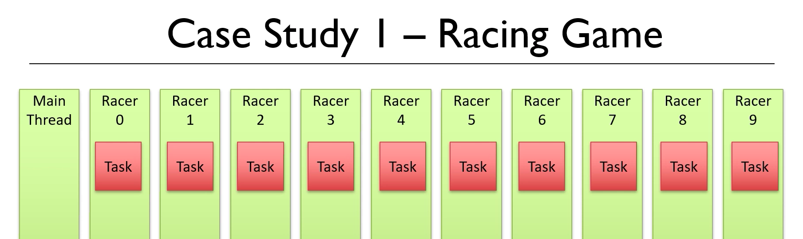
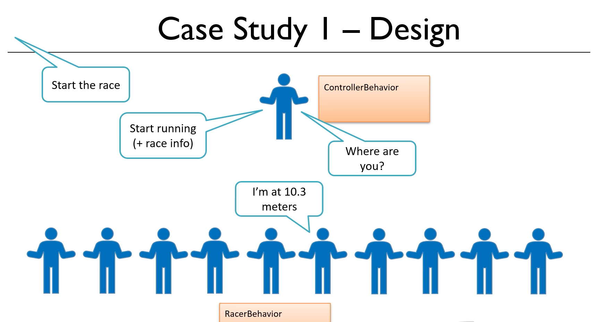

24. Introducing the case study

```java
import java.util.Map;
import java.util.Random;

public class Racer implements Runnable{

	private int id;
	
	private int raceLength;
	private Map<Integer, Integer> currentPositions;
	private Map<Integer, Long> results;

	private final double defaultAverageSpeed = 48.2;
	private int averageSpeedAdjustmentFactor;
	private Random random;	
	
	private double currentSpeed = 0;
	private double currentPosition = 0;
	
	
	public Racer(int id, int raceLength, Map<Integer, Integer> currentPositions, Map<Integer, Long> results) {
		this.id = id;
		this.raceLength = raceLength;
		this.currentPositions = currentPositions;
		this.results = results;
		random = new Random();
		averageSpeedAdjustmentFactor = random.nextInt(30) - 10;
	}
	
	private double getMaxSpeed() {
		return defaultAverageSpeed * (1+((double)averageSpeedAdjustmentFactor / 100));
	}
		
	private double getDistanceMovedPerSecond() {
		return currentSpeed * 1000 / 3600;
	}
	
	private void determineNextSpeed() {
		if (currentPosition < (raceLength / 4)) {
			currentSpeed = currentSpeed  + (((getMaxSpeed() - currentSpeed) / 10) * random.nextDouble());
		}
		else {
			currentSpeed = currentSpeed * (0.5 + random.nextDouble());
		}
	
		if (currentSpeed > getMaxSpeed()) 
			currentSpeed = getMaxSpeed();
		
		if (currentSpeed < 5)
			currentSpeed = 5;
		
		if (currentPosition > (raceLength / 2) && currentSpeed < getMaxSpeed() / 2) {
			currentSpeed = getMaxSpeed() / 2;
		}
	}
		

	@Override
	public void run() {
		
		while (currentPosition < raceLength) {
			determineNextSpeed();
			currentPosition += getDistanceMovedPerSecond();
			if (currentPosition > raceLength )
				currentPosition  = raceLength;
			currentPositions.put(id, (int)currentPosition);
			try {
				Thread.sleep(1000);
			} catch (InterruptedException e) {
				// TODO Auto-generated catch block
				e.printStackTrace();
			}
		}
		results.put(id, System.currentTimeMillis());
		
	}
	
}

```

```java
import java.util.Map;
import java.util.concurrent.ConcurrentHashMap;
import java.util.concurrent.ExecutorService;
import java.util.concurrent.Executors;

public class Main {

	static int raceLength = 100;
	static int displayLength = 160;
	static long start;
	
	private static void displayRace(Map<Integer, Integer> currentPositions) {
		for (int i = 0; i < 50; ++i) System.out.println();
		System.out.println("Race has been running for " + ((System.currentTimeMillis() - start) / 1000) + " seconds.");
		System.out.println("    " + new String (new char[displayLength]).replace('\0', '='));
		for (int i = 0; i < 10; i++) {
			System.out.println(i + " : "  + new String (new char[currentPositions.get(i) * displayLength / 100]).replace('\0', '*'));
		}
	}
	 

	public static void main(String[] args) throws InterruptedException {
		
		Map<Integer, Integer> currentPositions = new ConcurrentHashMap<Integer, Integer>(); 
		Map<Integer, Long> results = new ConcurrentHashMap<Integer, Long>();
		
		start = System.currentTimeMillis();
		
		ExecutorService threadPool = Executors.newFixedThreadPool(10);
		
		for (int i = 0; i <10; i++) {
			Racer h = new Racer(i,raceLength, currentPositions, results);
			currentPositions.put(i, 0);
			threadPool.execute(h);
		}
		
		boolean finished = false;
		while (!finished) {
			Thread.sleep(1000);
			displayRace(currentPositions);
			finished = results.size() == 10;
		}
		
		threadPool.shutdownNow();
				
		System.out.println("Results");
		results.values().stream().sorted().forEach(it -> {
			for (Integer key : results.keySet()) {
				if (results.get(key) == it) {
					System.out.println("Racer " + key + " finished in " + ( (double)it - start ) / 1000 + " seconds.");
				}
			}
		});
	}
}
```
Hell again, in this chapter we're going to take a Java multi-threaded simulation example and convert it to Akka. This will hopefully bring to life what we've learned so far. It will give us the opportunity to practice what we've learned and we'll discover a few more features of Akka along the way. 

The example case study is a relatively simple racing game. I'm providing you with the standard Java code that will run this game using regular Java multi-threading in the starting workspace for this chapter. We'll be using the two files called **main.java** and **racer.java**. What we'll do is create a new Java project and we'll move these two Java files into that project. So this is going to be a new project and it's a standard Java project. We're not doing it as a Maven project this time, and that's just because we want to be able to run the two classes I showed you in the starting workspace. So a standard Java project, we don't need anything special going on. We'll give it a name, I think I'll call this one Java racing simulation.

And then when the project is ready, and we have the src folder, will move those two Java files into the src folder. Once again, we want to only have the two Java files in here, not the palm file. We're going to be using that later on in this chapter. Okay, well before we look at the code, I'd like to just run it so we can see what this application does. So we want to open up the main class and we'll be running the public static void main method. The idea of this application is that there are 10 racers competing in a race numbered from zero to nine. The plays of the game will each guess which racer they think will win and then start the race. So for example, let's imagine we want racer number three to win the race. When we click on one, what we see is each racer is running along the track. And when they reach the end, they finished. 

### run the Main program
Output of result
```txt
Race has been running for 25 seconds.
   ====================================================================================================
0  : ****************************************************************************************************
1  : ****************************************************************************************************
2  : ****************************************************************************************************
3  : ****************************************************************************************************
4  : ****************************************************************************************************
5  : ****************************************************************************************************
6  : ****************************************************************************************************
7  : ****************************************************************************************************
8  : ****************************************************************************************************
9  : ****************************************************************************************************
Results:
Racer 0 finsihed in 18.036 seconds.
Racer 1 finsihed in 21.049 seconds.
Racer 2 finsihed in 19.039 seconds.
Racer 3 finsihed in 15.031 seconds.
Racer 4 finsihed in 16.027 seconds.
Racer 5 finsihed in 19.039 seconds.
Racer 6 finsihed in 16.027 seconds.
Racer 7 finsihed in 18.036 seconds.
Racer 8 finsihed in 25.054 seconds.
Racer 9 finsihed in 20.044 seconds.

Process finished with exit code 0

```

When all the racers are finished, we're told which racer are finished, in which order and how long it took to run the race. So in our example, racer number three, finished last right at the bottom. Now this is all generated randomly. So if we run it again, we'll see that racer number three finishes in a different position. I'll pause the camera while this runs. And that's finished now. And this time racer number three came second. So let's have a look then at the code. Now I want to point out this isn't a serious game. It's a simple but I think realistic example that I've put together just for this course on how we can use multi-threading in Java to run a simulation. 

### Again rerun program
```txt
Race has been running for 27 seconds.
   ====================================================================================================
0  : ****************************************************************************************************
1  : ****************************************************************************************************
2  : ****************************************************************************************************
3  : ****************************************************************************************************
4  : ****************************************************************************************************
5  : ****************************************************************************************************
6  : ****************************************************************************************************
7  : ****************************************************************************************************
8  : ****************************************************************************************************
9  : ****************************************************************************************************
Results:
Racer 0 finsihed in 27.053 seconds.
Racer 1 finsihed in 20.036 seconds.
Racer 2 finsihed in 24.044 seconds.
Racer 3 finsihed in 17.031 seconds.
Racer 4 finsihed in 17.031 seconds.
Racer 5 finsihed in 17.031 seconds.
Racer 6 finsihed in 20.036 seconds.
Racer 7 finsihed in 19.036 seconds.
Racer 8 finsihed in 26.049 seconds.
Racer 9 finsihed in 18.034 seconds.

```


The project has just two classes, the **main** class and the **racer** class. And the idea is that as each race will have 10 runners competing against each other, we're going to be instantiating 10 instances of the racer or class. The racer the class as you can see, implements runnable to each racer of runs in its own thread. So we can think of this application as containing a main thread and then 10 racer threads. The main thread will instantiate each of the racer of threads and give each racer of its task and then start the race. 



### Racer class explanation:
As the race progresses, it monitors the progress of each racer and displays it on the screen, and then it prints out the results at the end. So let's start them by looking at the code in the racer class. At the top here, we've got a number of variables 
-	first as the ID that will be the unique ID of each racer, which will be a number between zero and nine. 
	`private int id;`
-	Next we have the race length. That's a value that we specify in the main class and pass into each instance of the race objects. And we can use this value to determine how long we want the race to be. Now on my computer, a number here around about a hundred creates a race that takes between about 25 and 30 seconds. So you might need to alter the number for the race length, which we'll see in a few minutes when we look at the code in the main class to get it to run on your computer and around the same amount of time.
	` private int raceLength;`
-	Next, we have two maps, one called **currentPositions** and one called **results**.
```java
    private Map<Integer,Integer> currentPositions;
    private Map<Integer,Long> results;
```	

Now, this is definitely not the best way to achieve what we're wanting to do, but it is a quick and easy way to do things. If you recall when the application runs the main thread in the application is going to be monitoring the progress of each racer, and then printing out at the end of the race the final results. So we have an issue that we need to share data between the threads. The main thread needs to know about the state of each racer thread, and then finally how long each racer took to run. Now the way I've chosen to implement this requirement, and again, it isn't necessarily a good option, but I just wanted to do something quick and easy is that the main thread will contain a map to store the current position of each racer, and a map to store the current running time for each racer. 

And then we pass references to these maps into each of the race instances so that the racers can set the values for their own record in these maps. Now we'll look at the way these map objects are being created when we look at the main class, but it has been done in a thread safe way. Okay, so the first few parameters here are set in the constructor of the racer class. Now most of the rest of the code here is about determining how quickly each racer runs. And I'll talk this through. But it isn't that important. If you don't fully understand this part, you can think of this as simply being an algorithm. And we'll be replicating the same algorithm when we go and put this into Akka in a little while. 

So I'm going to explain the algorithm. But don't worry too much. If it doesn't make complete sense, it's not that important. The idea then is that every racer, will have an average maximum speed that somewhere around this figure here 48.2 `private final double defaultAverageSpeed=48.2;`. Now because every race is different, we will say that the real maximum speed for racer will be somewhere between 10% lower than this figure and 20% higher than this figure. And that's determined by setting up a variable called the average speed adjustment factor. And you can see where we generate this, it's a random number, which is somewhere between minus 10 and plus 20 `averageSpeedAdjustmentFactor= random.nextInt(30)-10;`. 

And that's created in the constructor for this class. There's a method here called getMaxSpeed which uses the average speed adjustment factor to work out what the maximum speed is for this particular racer. 

```java
  private double getMaxSpeed(){
        return defaultAverageSpeed*(1+(double)averageSpeedAdjustmentFactor/100);
    }
```	

And then the final two parameters, the current speed and the current position. Well, they're self explanatory what they represent. And there'll be zero initially, because before the race starts, they were at the beginning of the racer at position zero, and they're not running so their speed is zero. 
```java
    private double currentSpeed=0;
    private double currentPosition =0;
```

The idea is that as the race proceeds, the speed might change, the colour position will change as it reaches the end. And when it reaches the race length, which if you recall, I've set to 100. That means this one has finished the race. Let's carry on looking down the code. The next thing we have then is a couple of helper methods, one that determines the distance that's been moved by the race at each second, based on its current speed, 
```java
 private double getDistanceMovedPerSecond(){
        return currentSpeed*1000/3600;
    }
```	

and one that determines what the speed of the racer should be right now. Now I'm not going to talk through the detail of the method, it's somewhat arbitrary. But it is, I guess, then the algorithm that makes this whole thing work. 
```java
 private void determineNextSpeed(){
        if(currentPosition <(raceLength/4)){
            currentSpeed=currentSpeed+(((getMaxSpeed()-currentSpeed)/10)* random.nextDouble());
        }else{
            currentSpeed=currentSpeed*(0.5+ random.nextDouble());
        }
        if(currentSpeed>getMaxSpeed()){
            currentSpeed=getMaxSpeed();
        }
        if(currentSpeed<5){
            currentSpeed=5;
        }
        if(currentPosition >(raceLength/2) && currentSpeed<getMaxSpeed()/2){
            currentSpeed=getMaxSpeed()/2;
        }
    }
```	

And then finally, we've got the run method. This, of course, is what happens when the race starts when the main method tells the racer to start racing. When all that actually happens in here is that every second, we recalculate the speed of the racer, and determine its current position based on that speed until the racer has reached the finish line. So that's the racer class. Let's have a look at the main class. 
```java
@Override
    public void run() {
        while(currentPosition <raceLength){
            determineNextSpeed();
            currentPosition += getDistanceMovedPerSecond();
            if (currentPosition > raceLength )
                currentPosition  = raceLength;
            currentPositions.put(id, (int)currentPosition);
            try {
                Thread.sleep(1000);
            } catch (InterruptedException e) {
                // TODO Auto-generated catch block
                e.printStackTrace();
            }

        }
        results.put(id, System.currentTimeMillis());
    }
```


### Explanation Main class

Well, this is reasonably straightforward. If we start in the **main** method, the first thing we do is we instantiate the two maps. And as you can see, I'm instantiating them as concurrent hashMaps. So that means these are thread safe, and therefore it's absolutely fine to pass these into the racer threads.
```java
 Map<Integer, Integer> currentPositions=new ConcurrentHashMap<Integer, Integer>();
 Map<Integer,Long> results=new ConcurrentHashMap<Integer, Long>();
```		

Then we're recording the start time before we start running the race. We're creating a thread pool with a fixed size of 10 and then starting each new thread with a racer of object instantiated in it. Now at this point, we wait until the race is finished. 
```java
  boolean finished=false;
```  

And while we're waiting, we're calling a method called display race, which is actually printing out to the screen, the current positions. That method is at the top here. And I've used a little trick just to make it look somewhat animated. It's not very pretty, I know, but it sort of works. And that is that every iteration every time we display the race, I'm printing out 50 blank lines, and that should just be enough to clear the console. So it may not work perfectly on your console.
```java
 private static void displayRace(Map<Integer, Integer> currentPositions){
        for(int i=0;i<50;i++){
            System.out.println();
        }

        System.out.println("Race has been running for "+((System.currentTimeMillis()- start)/1000)+" seconds.");
        System.out.println("   "+new String(new char[displayLength]).replace('\0','='));
        for (int i=0;i<10;i++){
            System.out.println(i+"  : "+new String(new char[currentPositions.get(i)* displayLength/100]).replace('\0','*'));
        }
    }

```	


You'll get some kind of reasonable looking output, like we saw on mine a few minutes ago. And then finally, once the results are in and we know the race is finished, so we shut down all those threads, and we print out the results to the console. Okay, so that's the Java version. It's not great. I personally don't like this approach of using concurrent hashMaps and passing those into the threads, I think waiting for the threads to have finished. And we're determining whether or not the race has finished whether all the threads have completed by looking at the size of one of those hashMaps. Well, I don't think that's great, because what would have happened if one of those threads had crashed. And there's another issue, which is we're using thread dot sleep here. And I'm dealing with the interrupted exception by slowing it from the main method. Actually, in the racer, there's a thread dot sleep, and we're just catching and ignoring the interrupted exception. So that's not great either. And I'm sure if you looked, you'll find some other issues with this code too. So the idea then is we're going to be improving on this by moving the code to Akka. 


-----------------------

25. Architecting the solution


Create project

POM.xml
```xml
<?xml version="1.0" encoding="UTF-8"?>
<project xmlns="http://maven.apache.org/POM/4.0.0"
         xmlns:xsi="http://www.w3.org/2001/XMLSchema-instance"
         xsi:schemaLocation="http://maven.apache.org/POM/4.0.0 http://maven.apache.org/xsd/maven-4.0.0.xsd">
    <modelVersion>4.0.0</modelVersion>

    <groupId>org.example</groupId>
    <artifactId>AkkaRacingSimulation</artifactId>
    <version>1.0-SNAPSHOT</version>

    <properties>
        <akka.version>2.6.3</akka.version>
    </properties>


    <dependencies>
        <dependency>
            <groupId>com.typesafe.akka</groupId>
            <artifactId>akka-actor-typed_2.13</artifactId>
            <version>${akka.version}</version>
        </dependency>
        <dependency>
            <groupId>com.typesafe.akka</groupId>
            <artifactId>akka-actor-testkit-typed_2.13</artifactId>
            <version>${akka.version}</version>
        </dependency>
        <dependency>
            <groupId>ch.qos.logback</groupId>
            <artifactId>logback-classic</artifactId>
            <version>1.2.3</version>
        </dependency>
        <dependency>
            <groupId>org.junit.jupiter</groupId>
            <artifactId>junit-jupiter-api</artifactId>
            <version>5.5.2</version>
            <scope>test</scope>
        </dependency>
        <dependency>
            <groupId>org.junit.jupiter</groupId>
            <artifactId>junit-jupiter-engine</artifactId>
            <version>5.5.2</version>
            <scope>test</scope>
        </dependency>
    </dependencies>
</project>
```

### RaceController class

```java
import akka.actor.typed.Behavior;
import akka.actor.typed.javadsl.AbstractBehavior;
import akka.actor.typed.javadsl.ActorContext;
import akka.actor.typed.javadsl.Behaviors;
import akka.actor.typed.javadsl.Receive;

import java.io.Serializable;

public class RaceController extends AbstractBehavior<RaceController.Command> {
    public interface Command extends Serializable{}

    private RaceController(ActorContext<RaceController.Command> context) {
        super(context);
    }
    public static Behavior<Command> create(){
        return Behaviors.setup(RaceController::new);
    }

    public Receive<RaceController.Command> createReceive() {
        return null;
    }
}

```

### Racer Class
```java
import akka.actor.typed.Behavior;
import akka.actor.typed.javadsl.AbstractBehavior;
import akka.actor.typed.javadsl.ActorContext;
import akka.actor.typed.javadsl.Behaviors;
import akka.actor.typed.javadsl.Receive;

import java.io.Serializable;

public class Racer extends AbstractBehavior<Racer.Command> {
    private Racer(ActorContext<Command> context) {
        super(context);
    }
    public static Behavior<Command> create(){
        return Behaviors.setup(Racer::new);
    }

    @Override
    public Receive<Command> createReceive() {
        return null;
    }

    public interface Command extends Serializable{}

}

```

one of the things that the racing simulation makes a lot of use of right now then, is this **thread.sleep** method. Now, we will never do **thread.sleep** in  **Akka**. In fact I'm going to repeat that because it's really important. **Thread.sleep** can throw an **interruptedException** in Java and we don't want those. So we will never do a **thread.sleep** in  **Akka**. Instead, to convert this to  **Akka** code we need to re-architecture the code somewhat. We need to think about this in a different way. 

Our actor system, that's the user guardian, the first actor that we create or our entry point into  **Akka**. This is going to be the controller of the race. We'll say that this has a behavior that we'll call the controller behavior. And then we're going to have 10 runners. So they're also going to be actors and I think we'll call these the racer actors, and we can give these the behavior that we'll call the **racer** behavior. 


So the **racer** actors are going to be able to receive messages that say for example, start running. Now this message, as well as being the instruction to start, will also need to contain some initial information about the race such as the race length. And when the start running method is received we'll do things like determine the maximum speed of the racer. The controller might also send a message of type, where are you, that will be the way for the controller to watch each of the racers to give it an update on its current position. So when this message is received, the racer that receives it will calculate its current position and send it back to the controller. So to set this up then, the racers are never going to be sleeping with **thread.sleep**. Instead they are just really going to sit there idle until they receive a message, and when they get a message they're going to do some work such as calculate the current position, send it to the controller, and then effectively they'll just become idle again until the next message is received. So it's very important to understand there's a very different concept here to the traditional Java idea of using **thread.sleep** to send a thread to sleep, to say, pause, don't do anything for a fixed amount of time, and the  **Akka** version where threads by default are just going to sit there idle until they receive a message and they''ll only do work in response to receiving a message. Okay, so the controller actor then, is going to be able to also receive messages that say things like, start the race. That's going to come from the main class or outside the  **Akka** system. When the controller receives this message, it can instantiate the racers and tell each of them to start running. So once the race has started, every second or so it will send one of the racers one of the, where are you, messages, and to achieve that, that's sending messages on a regular frequency. Well again, we're not going to use **thread.sleep**, instead we'll set up what is called a timer. So  **Akka** has a facility to repeat sending messages to an actor on a regular timed basis and we can use that to achieve the functionality we need. And of course, then the racers can send back the message to the controller to say where they are. So that's the idea of how this is going to be structured. Let's start coding this up. So we'll create a new project and this time it will need to be a Maven project because we want to get the dependencies that we need for  **Akka**, into our application, so we'll just go and do that. 

===========

### Start new Project

And I think we'll call this one,  **Akka** Racing Simulation. And let that get set up. And then I've provided you with the **pom.xml** file that we need for this project in the starting workspace for this chapter. It's exactly the same as the **pom.xml** file that we used in our first  **Akka** project a few chapters ago. So copy the content of this file. I'm just going to open it in a text editor, and we'll paste that into the **pom.xml** file of our application. Actually, the artefact idea, I did genuinely just copy this from the previous example, so I suppose we probably should change that from  **Akka** Big Primes to  **Akka** Racing Simulation. And then we need to import the changes so that all the dependencies get into our application. Okay, well that looks like it's worked. I can see all the  **Akka** dependencies there in my external libraries so I think we're ready to start. So the first thing I think we should do is create the actors and their most basic command types. 

```java
import akka.actor.typed.Behavior;
import akka.actor.typed.javadsl.AbstractBehavior;
import akka.actor.typed.javadsl.ActorContext;
import akka.actor.typed.javadsl.Behaviors;
import akka.actor.typed.javadsl.Receive;

import java.io.Serializable;

public class RaceController extends AbstractBehavior<RaceController.Command> {
    public interface Command extends Serializable{}

    private RaceController(ActorContext<RaceController.Command> context) {
        super(context);
    }
    public static Behavior<Command> create(){
        return Behaviors.setup(RaceController::new);
    }

    public Receive<RaceController.Command> createReceive() {
        return null;
    }
}

```

For both the controller behavior and the racer behavior classes we're going to define their commands as interfaces. So we'll start I think, with the controller. Let's call this race controller. And then it's going to, as we've done before, extend abstract behavior. Now abstract behavior is a generic type but we need to create the object type first, that we can put in here. So I'm immediately going to create this interface. So that's going to be a public interface which we are going to call command, and we'll extend the serializable interface, and I'll just put in an open-closing curly brackets, and then now I can say our race controller extends abstract behavior of **racecontroller.command**. Okay, just to get this to compile, let's get the ID to generate for us the constructor and the message handler. And I'll come back and edit these in a few moments. So that's our race controller class. So we're making the constructor private and we're creating a public static helper method which we're going to return a behaviour of type command. We're calling it Create and in here we return behaviors.setup, and then we call the constructor with RaceController::new. Okay, that's all good.

```java
import akka.actor.typed.Behavior;
import akka.actor.typed.javadsl.AbstractBehavior;
import akka.actor.typed.javadsl.ActorContext;
import akka.actor.typed.javadsl.Behaviors;
import akka.actor.typed.javadsl.Receive;

import java.io.Serializable;

public class Racer extends AbstractBehavior<Racer.Command> {
    private Racer(ActorContext<Command> context) {
        super(context);
    }
    public static Behavior<Command> create(){
        return Behaviors.setup(Racer::new);
    }

    @Override
    public Receive<Command> createReceive() {
        return null;
    }

    public interface Command extends Serializable{}

}

```
Let's set up our racer class then, the class that's going to define the behavior for our racer actors. So again, a new Java class which we'll call Racer this time. Once again, it needs to extend abstract behavior. And we'll want to put in a command interface that we're going to use to define the message types that this actor can receive. So that will be a public interface, command, extend serializable. Then we can say that our racer expects to receive racer.command messages. I'll just spell that correctly. And then, oh I'll need to import abstract behavior of course. Make sure we get the one from Java DSL and then again, we'll get our ID to generate for us the message handler and the constructor. Okay, so I think we should just sort out the constructor by making it private and putting in create methods like we've done before. If you want to pause the camera and have a go at just doing that, please do, but I'll do that walk through and then we'll carry on working in the next video. So we're going to make the constructor private. Instead we're going to create a public static method which is going to return an object of type behavior with the generic type command. We're going to call it Create, and what we'll do in here is return and we use the helper method from behavior class. That's behaviors.setup, and then in here we want to call the constructor. So that's simply, racer::new. Okay, let's import behavior. And that looks to be compiling okay. 


-----------------------

26. Implementing the case study


```java
public class Racer extends AbstractBehavior<Racer.Command> {

}
```

```java
public class RaceController extends AbstractBehavior<RaceController.Command> {
}
```

We're ready now then to start implementing the detail of our case study and are going to start in the racer behaviour. Now we know that the racer is going to receive a command to say start running and they command to say, "Where are you" to get your current position. So I think we'll start by creating these two command types. Now I like to structure my code so that all the commands appear right at the top before the constructor, so I'm going to move this interface up to the top and then we'll create the commands immediately below it. 


### inside Racer class StartCommand
```java
  public static class StartCommand implements Command{
        private static final long serialVersionUID=1L;
        private int raceLength;

        public StartCommand(int raceLength) {
            this.raceLength = raceLength;
        }

        public int getRaceLength() {
            return raceLength;
        }

        public void setRaceLength(int raceLength) {
            this.raceLength = raceLength;
        }
    }
```	

So we'll start with the start command. So that's going to be a public static class, which we'll call starts command and it needs to implement the command interface that we created. And then the first thing I'll do is just put in the setup for the serial version UID, so that's going to be a private static final and it's an long called serial version UID and we'll set that equal to one. Okay, so the start command doesn't need to contain the word start within it because the whole command is going to be the idea of starting the race. But what we will want to do in here is include some information about the race for the racer to take and use. And it needs to actually know in here, the lace length. 

### Inside Racer class
```java
 public static class PositionCommand implements Command{
        private static final long serialVersionUID=1L;
        private ActorRef<RaceController.Command> controller;

        public PositionCommand(ActorRef<RaceController.Command> controller) {
            this.controller = controller;
        }

        public ActorRef<RaceController.Command> getController() {
            return controller;
        }
    }

```

So let's have a private variable, which will be an int called race length. And I think, for now, that's the only data we need to pass inside this command. So we'll set up a constructor, which allows us to specify the race length and that then will be an int race length and within the body of the constructor, we'll set that private variable and then we'd like a getter for that variable as well, so that will be a public int get race length. And will return race length? Okay, so that's the start command set up. 


Let's have a go now at the position command, the one that says, "Where are you right now." So again, it's going to be a public static class. We'll call this one position command. And it needs to implement that interface. And again, we'll copy in the serial version UID. And then what data needs to be sent along with the position command? Well, we'll certainly want a reference to the controller because when we receive this, "Where are you," we're going to have to send a message back to the controller to say I'm currently at this particular position. So we'll want to have an actor ref for the controller. So that's going to be a private variable, of type actor ref and it's an actor ref for the race controller dot command because that's the message type we're going to be able to send to this actor ref and I think we'll call this controller. Let's import actor ref, and actually, I don't think, for now at least, there's any other data we need to pass in with the position command, so I think this time, I'll get the ID to generate for me the getter method and the constructor. So doing generate constructor with the actor ref command being passed in and generate the getter for the controller. Okay, so we've set up the two command types that our racer can receive. Now within the body of the racer then, before we can start working on the message handler, there's some private variables and some helper methods that we'll want to get into the class that we can copy from the previous Java version. So I'm going to get the previous Java version open, I think just in a text editor. And I hope you're following along with me, we're going to copy the five variables that appear at the top that are the default average speed, the average speeds adjustment factor, a random object and the current speed and current position variables. We'll want all of those in the   version. So we can copy and paste those in and I'll just import random. And then there were also some helper methods and we might need to change some of these as we code through. But for now, let's copy in the get max speed, get distance move per second, determine next speed methods, those three, we'll copy those into our project as well. And we'll, just to make this compile, the determine next speed method expects there to be a variable called race length. So we haven't got that one just yet, we're actually going to receive it in the message on the start command. So let's create a local variable called race length as well, I'll put that I think at the top here, that's going to be an int. And then hopefully, the code we've written so far will compile. So before we start creating the message handler then, let's just quickly recap. What we've created for our racer is an actor behaviour that implements two commands so far, a start command and a position command and then within here, we've also got a number of variables, so there's some state and there's some helper methods that we might be calling when we start with the message handler. So let's have a look then at the message handler and the first command that we want to do with is if we receive the start command. So we always start then by returning a new receive builder. And we'll be calling dot build at the end of that. And then in here is where we want to check for the different message types. The first message type is the start command and to check for a particular message type, we use the on message method. So the class type is start command dot class. And then if we get one of those, the code that we're going to run is a lambda, it has one parameter which I think we can call message. And within the body of the lambda, we need to return something, so for now, we're just going to return this. Okay, so what processing do we want to do when we receive one of these start commands? Well, the first thing we want to do is definitely set the value of that race length variable that we set up because we're going to receive that within the body of the start command. So we should be able to do, in here, this dot race length is equal to message dot get race length. So that's the first thing we'll want to do, we probably should instantiate that random object that we got up here because we did that in the constructor in the Java version, so here's a good opportunity to do that. So we should be able to do this dot random is going to be equal to a new random object. And then the final thing we'll want to do is work out the average speed adjustment factor, that's this value here. Again, this is something we did in the constructor in the Java version, you can go and have a look at that if you want to, I'm really just repeating the code from there, and what we did is we said this dot average speed adjustment factor is equal to. What we want to get a new random integer between zero and 30, so that's going to be random dot next int with the number 30 in brackets, but then we want to take 10 off that, so that gives us a number between minus 10 and 20. So that's the first of our two message handlers. Next, we want to handle the other command, the "Where are you" opposition command I think we called it, so let's do an on message, for the position command type. And the message we will receive is going to implement the lambda, we'll wanted to overturn this at the end and for the code in here, well, we'll be receiving one of these position commands every second, so I think we can pretty much use most of the code we had in the Java version. So I've got that on-screen here and it's in the run method. And the code we want is starting at this point here that determines the next speed and we'll copy it down to this line here, compositions dot put, we're not going to do the thread dot sleep. So let's copy that, paste this in here and then we'll have a look at it. So I think this starts off okay, we're determining the next speed within setting up whatever the current position is and I think that should be okay, we're saying if the composition is greater than the race length, then that means we finished and we make our current position the race length and then we'll have this line of code in the Java version was adding in our current position to the HashMap, we're not going to do that. Instead, what we want to do is send a message to the controller with the current position. And I'm going to just put a comment in here to remind us that's what we want to do here, tell controller current position. We can't actually write that line of code just yet because we haven't got a message type in the controller class to use to send that message to the controller. Right now, all we've got in the controller is an interface of type command, we haven't gotten the implementations of that interface, so we can't yet create the message to send to the controller. So let's do that and then we'll be able to come back and finish off this message handler. 


So in our controller, it's going to receive a number of message types, there's going to be a start a message. That's the instruction to start the race which you'll get from our main method or outside of **Akka**. And then we'll have one of these race update commands, the message that the racer can send back to the controller to tell it where we are. So we'll start I think with the start command. Again, I'm just going to move the interface to the top and then put the commands immediately after it. So we're going to have a public static class which we'll call start command. It is to implement the command interface. We'll want one of those serial version UIDs in here. And I don't actually think we need anything else in the start command, it doesn't need any state, it's just an instruction to say start running, we don't need any fields in here at all, that will be all we need to do. The second class type is going to be the racer update command. So again, public static class, we'll call it racer update command. And again, it needs to implement command. We'll want that serial version UID, so let's copy and paste that in, but this time there is going to be some state, so we might need to know which racer is sending this command. So let's have a reference to the racer. So that will be a private actor ref. Now the message type the racer can receive is racer dot command and we'll call this racer I think and let's import actor ref. And then we'll also have the position, that's the information the racer is telling us, where is it, so that can be an integer I think. And then let's create the construct and some getter methods. And I'll get the ID to do that for us. So we'll generate a constructor, which will take both the racer and position, and then some getters for the racer and position as well. Okay, so that's the to command type setup within the controller and that means we can go back to our basic class now and finish this off, 


we want to tell the controller current position, where the controller or the reference, the actor ref of the controller is contained within that message. So what we should be able to do here is message dot get control up, that's the actor ref, so we can call the tell method on it. And what do we want to tell it? We want to create now a new racer update command. So that's going to be a new and it's race controller dot race update command, that needs to take two parameters, a reference to this actor, so that's going to be get context get self. And the second parameter is the current position and that's a local variable here as well. Actually, I think current position we've got here is a double, so let's just cast that to an int as we send it across. Okay, I'm just going to make this part of the window bit bigger so that the full line of code is visible and I think that looks okay. 


Now let's start coding up the race controller's message handler. Now within the race controller, we're going to need a map to store the current positions as the race progresses. But unlike the Java version, this won't need to be a thread-safe object because we'll just be keeping it within this class, it won't be visible to any other actor, it won't be accessed outside of the single thread that this actor is running, so it can be a regular HashMap. So before our message handler, let's create here a private map, which is going to have then the key, which is going to be our racer. So that's an actor ref with the racer dot command being the generic type for the actor ref and the value is going to be the position, so that can be an integer. And we'll call this current positions. Now we'll instantiated I think inside the message handler when we start the race, but let's just import the map object type. And the other couple of variables I think we'll want to have here is going to be to record the start time, so that's going to be a long. And let's also have the race length defined here as well. That will be an integer and we'll set it to 100, the same as we had it in the Java version. If you wanted that number, then you'll want to order that here to match. Okay, well, let's start creating then the message handler, so we're going to return a new receive builder and we'll call dot build at the end of that. And then in here, well, there are two message types. There's the start command, so let's have an on message for the start command. And the handler is going to do something, so we'll need to define a lambda in here which is going to return this. And actually, let's create the structure for the other one as well. So we'll do an on message for the, I think we call it racer update command, yes, we did. And now let's start thinking about the code then. So the start command, well, when we receive this, and that's the instruction from outside of **Akka** from our main method to say start the race up, the first thing we want to do is record the start time. So we've got that private variable we set up here, we can do start equals system dot current time millis. Next, let's instantiate this current positions HashMap. And it will just be a regular HashMap, we don't need to do anything special with that one. So that should be current positions equals a new HashMap. And now we want to set up each of our racers. So we want 10 of them, so we'll do to do a loop for int i equals zero, i is less than 10 i plus plus. And within the loop, what we're going to do is create a new instance of our racer class. So it's going to be an object of type actor ref of racer command, which we can call racer and we'll set that equal to well to create a new actor, we do get context spawn and then we want to call the helper method, the create method of the actor type that we're creating, so that is racer dot create and that should create our racer, but we need to give it a unique name, so let's call it racer and we'll append on to the end of that the value of i. So we should get racer zero racer one and so on. So we've created the racer, the next thing we should do is update our current positions map to say we've got a racer and it's at position zero because it hasn't yet started the race. So we should be able to do here command positions dot put, while the actor ref is racer and the position is zero. And then now we should be able to tell the racer to start running, so that will be racer dot tell, I'll need to pass in then a new racer start command that takes a single parameter which is the race length and that's this parameter here. Okay, so that deals with the start command, let's have a look at the race update command. So when a racer tells the controller I've moved and my current position is, well, whatever it is, all we want to do is update the value for that racer in the current positions HashMap. So we should be able to do in here a current positions dot put and we want the reference to the racer and we can get that from the message. And we want this current position and again, that we can get from the message and I think that looks good.

27. Scheduling and timers


Everything we've coded up so far in this chapter has really been practising what we've learned about before. But now, we're going to need something new. We want our controller to send each racer a message that says, "what is your current position," and we want to do that every second. And for this, we need a timer. Now the way that timers work is a little bit complicated, so I'm going to try and explain this, bit-by-bit, building up the knowledge. Right now, when we finished processing one of the messages, we return this. Now, I'm going to explain what this is a little later on. I keep promising you that, and we will get to it very soon. But before I go into the detail about it, there is an alternative here, which is that we can, instead of just returning this, we can use the return line to create a timer. A function that will run either every second, or every five seconds. Well, whenever we like, really. 


I've got on screen here the syntax for how we create a timer. We start with a helper method from the behavior class. If you remember, we've seen behavior before. We've used behaviors.setup to create an actor within that create method. Well, this time, we're going to be using another helper method on the behaviors class, a static method, called withTimers. And this with timers takes a parameter which is a Lambda, and it's a single parameter Lambda, which actually is the timer's object. So, we can think of Behaviors.withTimers as a way of generating a timer's object that we can then use. And the way we use it is by calling a method on that timer object, and I'm using one particular example method here, we'll see some of the others in a few minutes, and that is start timer at fixed rate. And this method allows us to run a piece of code at a regular frequency. This takes three parameters, a key, and I'm going to say more about the key in a moment, what we want to happen when the timer fires, which I'm calling the instruction, and then the frequency, how often we want this instruction to take place. Now, this looks quite complicated. So, let's start coding it up, and then we can also explore the options, and we'll understand a bit more about how these timers really work. 


So the idea, then, is that as soon as we have started the race, we've set up all ten actors, and we are ready to say, "I've finished processing "the very first start method," that's when we're going to set up the timer. So, rather than returning this, at this point, we want to create a timer, and we do that with behaviors., and then it's that withTimers helper method. (clicking) So, withTimers takes a Lambda, and the parameter, it's a single parameter Lambda, which we'll call "timer," I think. And then in here, we can do timer., and then call one of these methods. Now there are really two methods that we can use here. StartTimerAtFixedRate or startTimerWithFixedDelay. They're quite similar.

The first one, startTimerAtFixedRate will fire off the code every time this frequency is reached, even if the last time that the frequency was reached, the processing that occurred hasn't actually finished yet. The second one, startTimerWithAFixedDelay, will start the work running after a fixed delay after the last time it worked has finished. So, if you've got some code that could take a long time to run, you may want to choose the second option. I think we'll choose the first option. The way you use them is identical. But, I will also just say that the other method startSingleTimer actually is deprecated. So you should be using one of these two. Well, let's use startTimerAtFixedRate, and I'm saying that this method is going to allow us to run a piece of code every so many seconds, but actually, that's not quite what happens. We don't run code, but rather, this method makes the actor, our RacerController, send a message to itself every time the frequency that we define gets ready to be executed. So, to make this completely clear then, this is how the timers actually work. We've got our controller, which is the controller actor, and it's going to receive the very first message from the system from outside of akka, which says start. When it receives this message, it's going to set up all the other actors, and it's going to send them the first message, which is the start running message. Then, it's going to create the timer. Now, when the timer occurs, what's going to happen is it's going to send a new message to the controller actor. When the controller actor receives this new message type, then it's message handler can do something. In our case, it's going to send a message to each of the actors to say, "Where are you? "What's your current position?" So, hopefully then, you can see the whole process is completely driven by messages. There's no concept of threads sleeping. Instead, every actor is reacting to messages that are being received. And by creating a timer, what we are actually doing is we are setting up a way to generate future messages on a regular basis. So, I hope that's clear. It's quite clever really, because it means we don't need to do, ever, a thread.sleep. All we're doing is creating messages that are going to be received at some point in the future. Okay, well to code this up, we're going to need a new message type. We need one of these "It's time!" messages. Something that the controller can receive to say, "The timer has fired, you now need to do something." 


Well, I think we should call this the GetPositionsCommand. So, back up to the top of this class, where we've got the StartCommand and the RacerUpdateCommand, we're now going to have a new one, which is the GetPositionsCommand. But, this class is going to be generated from the timer within the controller, and it's sending it to itself, to the controller. It doesn't need to be ever generated from outside of this class, which means it doesn't need to be public, and it doesn't need to be static. We can make this one a private class. 


And so we're going to call it GetPositionsCommand. And of course, it needs to implement command. (clicking) And I don't think it needs any parameters in here, but I will just copy in the private static long, serial version UID. Okay, so we've got this new command type, so now we can go back to that message handler, and we'll be setting up our timer. What we're doing is we're saying we're going to start a timer at a fixed rate, and we need to provide three parameters. The third is a key, and I've not said anything about this key just yet, but for now, I'm just going to type in in capitals, "TIMER_KEY," and we'll come back and look at that in just a moment. The next is, what's the message that we want to be sent whenever this timer occurs, and that's our new GetPositionsCommand. 


So we can just instantiate that here with new get positions command, and then how often do we want to get this positions command? Well, we want to run it every second. So here, we can do Duration.ofSeconds and a one. So that should make this occur every second. And there's a final thing we need to do within the Lambda, which is we do the "return this," which of course is the same as we had down here. We're really wrapping this "return this" within an option to create this timer. So, to make this work, the final thing, that is, what is this timer key? Well, actually, it's a bit like an ID for the timer. It's any object, and the idea is that if we start one of these timers and use the same timer key, that overrides the previous timer. So it works a bit like a unique ID for the object, but actually, all we need to do is create an object with the name TIMER_KEY. So, up here, we're just going to do private object, and we're calling it TIMER_KEY. And I've put it in capitals just to indicate it's something a little bit different, it's not really anything with any state, it's just something unique, so that if we want to later, maybe run this every five seconds, we could rerun this whole line of code, and as long as we used TIMER_KEY so it matched, that would override the existing timer. 

```java
 return Behaviors.withTimers(timer -> {
                        timer.startTimerAtFixedRate(TIMER_KEY, new GetPositionsCommand(), Duration.ofSeconds(1));
                        return this;
                    });
```					

There is one timer per timer key. Okay, so at this point, the controller is setting up the race, and setting up a timer to generate lots of messages of type GetPositions. And the final thing we're going to do then, is implement this GetPositions message handler. What happens when our controller receives one of these GetPositionsCommands? Well, well it's at that end. So, on message, and it's a GetPositionsCommand message, (clicking) and what we'll want to do in here is take that message and implement some kind of Lambda. We'll want to return this at the end of the Lambda, but before we do that, well, what we'll want to do is send a message to each of the racers to say what's your current position? Well, we've got a list of the racers in that CurrentPositions map, so we should be able to loop through them. So, I think we can do something like "for". 

```java
.onMessage(GetPositionsCommand.class, message -> {
                    for (ActorRef<Racer.Command> racer : currentPositions.keySet()) {
                        racer.tell(new Racer.PositionCommand(getContext().getSelf()));
                        displayRace();
                    }
                    return this;
                })
```				
Now, each racer is an actor type ActorRef, with the generic type racer.command. We'll call it racer in the set of keys for our HashMap, so that is currentPositions.keySet. (clicking) And then, for each racer, what we're going to do is send it a message to say, "Where are you?" So, that is going to be racer.tell, it's a new "where are you" command, so that's a new racer., and I think we called it PositionCommand, there it is. And this command takes a single parameter which is a reference for the controller, so that is getContext, getSelf. Now, I've got a lot of brackets there, but I think that looks like it's going to compile, so I think that looks okay. In fact, once we've sent that message, let's then call the displayRace method, that helper method which is going to replay something nice on the console.

```java
    private void displayRace() {
        int displayLength = 160;
        for (int i = 0; i < 50; ++i) System.out.println();
        System.out.println("Race has been running for " + ((System.currentTimeMillis() - start) / 1000) + " seconds.");
        System.out.println("    " + new String (new char[displayLength]).replace('\0', '='));
        int i = 0;
        for (ActorRef<Racer.Command> racer : currentPositions.keySet()) {
            System.out.println(i + " : "  + new String (new char[currentPositions.get(racer) * displayLength / 100]).replace('\0', '*'));
            i++;
        }
    }

```


Actually, it looks like we haven't got displayRace copied in here, so let's go and get that from the Java code in the previous version of this project. (click) That's here. And we'll paste this in here. I think I'll put it in before the message handler. Well, it no longer needs to be a static method, 'cause it was only static because it was in the method previously. Now, that uses a variable cord display length. If we have a look, okay, that was just an integer with a value of 160. So let's just define that, I think, within this method. Let's just do here int displayLength equals 160. And that looks like it's going to compile, or at least it will when we check here. Our calling displayRace is expecting a parameter. The parameter is the current positions, and that is a map of Integer, Integer, so let's use the existing, current positions and we'll just make this work. (click) And then, down here, what we'll want to do is, we don't want to loop through the number zero to 10, because we did that so we could call "get" and the number, but actually, what we've got now is the HashMap. So, we'll want to loop through each of the entries in the HashMap instead, I think. So, let's do "for", it's going to be an object or type ActorRef, and that's an ActorRef with a racer.command message type, which we'll call "racer," in currentPositions keySet. And then, for each racer, what we'll want to do is print out, well the racer's ID, I think the easiest way to do this is actually going to be to have a variable cord I and let's set that to zero initially, and then after we've printed each one out, we can incriment I, and then in our print line, we're printing out the number I, a new string, we want to get positions, get, and it's now the racer. And, I think that's going to be okay. I think that will complete that. So, the code certainly is compiling now so that looks better. Let's try and test this, and see if it really is working. And to do that, 

```java
import akka.actor.typed.ActorSystem;

public class Main {
    public static void main(String[] args) {
        ActorSystem<RaceController.Command> raceController = ActorSystem.create(RaceController.create(), "RaceSimulation");
        raceController.tell(new RaceController.StartCommand());
    }
}

```

we're going to need to create a main class, (click) (clicking) with a runner board main method. And in here, what we want to do is instantiate the controller, which is the actor system. So it's an object or type ActorSystem, with a generic type of a RaceController.Command, which we're going to call raceController, and we instantiate that with ActorSystem.Create, and make sure you pick the one from akka.actor typed, and then in here, we pass in two parameters a new instance of our RaceController, which we get with that helper method called create, and then a name that could be "RaceSimulation." Okay, we've got a things to import here. So, ActorSystem, make sure you pick the one from akka.actor.typed, and that looks okay. That looks like it's compiling, so now we can send our RaceController the message to start the race. That will be raceController.tell, and it's a new RaceContoller.StartCommand, which doesn't need any parameters. Okay, well the moment of truth. Let's run this and see what happens. 


Okay, well, that looks to be working. We're not printing out the final results just yet. To do that, we'll need to know a bit more about actor life cycles, which we'll be learning about in a couple of chapter's time. But, before we leave this chapter, I want to point out a few things. What we've implemented here isn't exactly the same as what we did in Java, although I think it's fine in the context of what we're trying to achieve. In the Java version, we tested something every one second. Here, we're sending messages every one second, and we're getting data back at some point in the future. In fact, we're just assuming that the messages received each second in the racer class, which may not be quite right, and we're updating the position of each racer on the screen before, actually, we get the latest set of results back. Now, I guess we could take this further by storing the position and time of each racer within the racer class, and then getting this out at different times, but as I said, for the purposes of this simple simulation, I think what we've implemented is fine. I just didn't want to leave this chapter with you thinking it's not an exact replication of the Java multi-threaded version. And actually, that's a point worth understanding. When we work with akka and the actor model, because we need to think in a different way to the way that threading works in standard Java, we often do come up with a different solution to the problem, and of course, there's nothing necessarily wrong with that. (click) Okay, well coming up in the next chapter, we're going to look a little bit deeper into what we can do with actor behaviours. So, take a break if you need to, and when you're ready, I'll see you there. 


